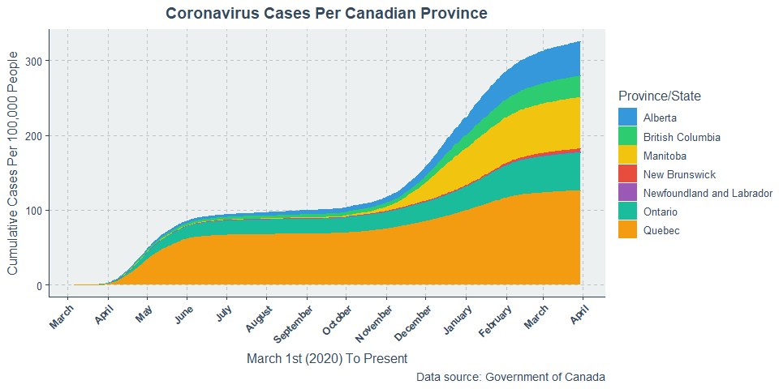
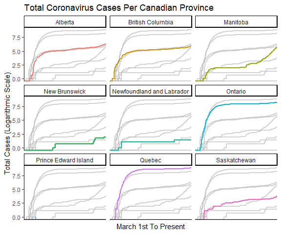
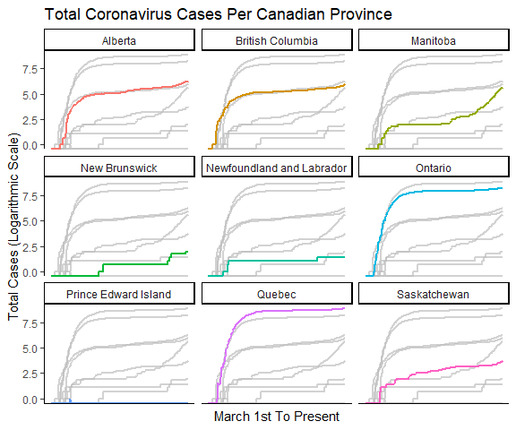
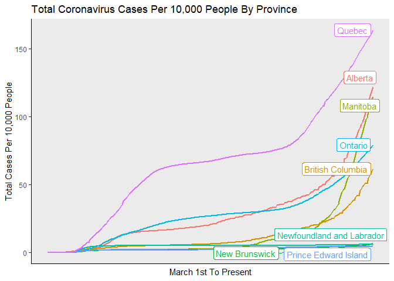
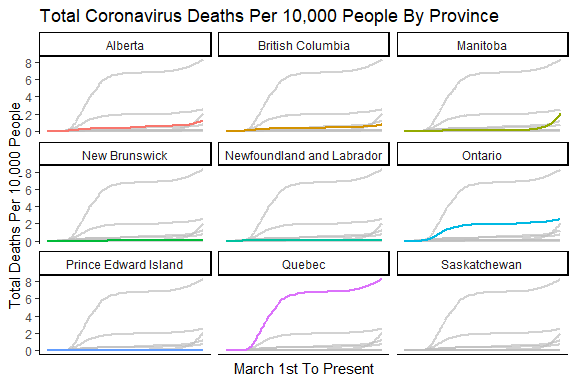
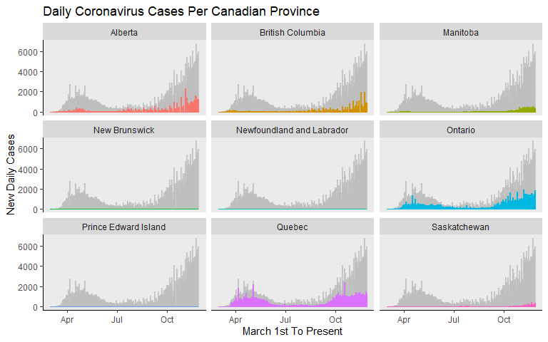
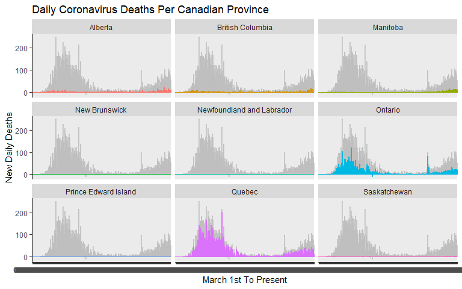

COVID-19 Canadian Data: Pre-processing And Simple Visualizations
================
Stephen Pierzchajlo

The easiest way to follow the COVID-19 pandemic is to download the data
for yourself and decide what level of analysis you want to engage in.
Because I am from Canada, I decided I wanted to follow the pandemic at a
Canadian province level. <br> In this analysis, I’ll demonstrate how
easy it is to set up a script that automatically takes COVID-19 data for
the entire world, reduces it to only include regions you want, and then
displays some simple figures that include up-to-date cases and deaths in
the region you are interested in. I chose this analysis because the data
are not readily available in a format that can be easily visualized.
Instead, we need to do some work to get things in shape. <br> Thus, I
will take worldwide COVID-19 data and make a script that, whenever run,
updates and displays COVID-19 data from Canada that contains data as
recent as yesterday.

``` r
# Load libraries
library(tidyr)
library(ggplot2)
library(gghighlight)
library(plyr)
library(readr)
library(plotly)
library(ggpubr)
```

Their are different COVID data repositories, however I found a github
account that links to different worldwide .csv files. Each file contains
data about total worldwide cases and total worldwide deaths up until 24
hours ago. Each time we run the code chunk below, it grabs an updated
.csv file from github.

``` r
# Here, we load .csv files from github. These are updated daily, so everytime this analysis is run, it uses the most up to date information.

# Total Global Cases Data
COVID_Global_Wide<-read_csv(url("https://raw.githubusercontent.com/CSSEGISandData/COVID-19/master/csse_covid_19_data/csse_covid_19_time_series/time_series_covid19_confirmed_global.csv"))

# Total Global Deaths Data
COVID_Global_Deaths_Wide <-read_csv(url("https://raw.githubusercontent.com/CSSEGISandData/COVID-19/master/csse_covid_19_data/csse_covid_19_time_series/time_series_covid19_deaths_global.csv"))

# Total Global Recovered Data.
COVID_Global_Recovered_Wide <-read_csv(url("https://raw.githubusercontent.com/CSSEGISandData/COVID-19/master/csse_covid_19_data/csse_covid_19_time_series/time_series_covid19_recovered_global.csv"))
```

As seen below, the file arranges the .csv filesuch that each column is
date, with the value in the cell corresponding to the total cases up
until that point. This format is not easy to work with.

``` r
head(COVID_Global_Wide)
```

    ## # A tibble: 6 x 315
    ##   `Province/State` `Country/Region`   Lat   Long `1/22/20` `1/23/20` `1/24/20`
    ##   <chr>            <chr>            <dbl>  <dbl>     <dbl>     <dbl>     <dbl>
    ## 1 <NA>             Afghanistan       33.9  67.7          0         0         0
    ## 2 <NA>             Albania           41.2  20.2          0         0         0
    ## 3 <NA>             Algeria           28.0   1.66         0         0         0
    ## 4 <NA>             Andorra           42.5   1.52         0         0         0
    ## 5 <NA>             Angola           -11.2  17.9          0         0         0
    ## 6 <NA>             Antigua and Bar~  17.1 -61.8          0         0         0
    ## # ... with 308 more variables: `1/25/20` <dbl>, `1/26/20` <dbl>,
    ## #   `1/27/20` <dbl>, `1/28/20` <dbl>, `1/29/20` <dbl>, `1/30/20` <dbl>,
    ## #   `1/31/20` <dbl>, `2/1/20` <dbl>, `2/2/20` <dbl>, `2/3/20` <dbl>,
    ## #   `2/4/20` <dbl>, `2/5/20` <dbl>, `2/6/20` <dbl>, `2/7/20` <dbl>,
    ## #   `2/8/20` <dbl>, `2/9/20` <dbl>, `2/10/20` <dbl>, `2/11/20` <dbl>,
    ## #   `2/12/20` <dbl>, `2/13/20` <dbl>, `2/14/20` <dbl>, `2/15/20` <dbl>,
    ## #   `2/16/20` <dbl>, `2/17/20` <dbl>, `2/18/20` <dbl>, `2/19/20` <dbl>,
    ## #   `2/20/20` <dbl>, `2/21/20` <dbl>, `2/22/20` <dbl>, `2/23/20` <dbl>,
    ## #   `2/24/20` <dbl>, `2/25/20` <dbl>, `2/26/20` <dbl>, `2/27/20` <dbl>,
    ## #   `2/28/20` <dbl>, `2/29/20` <dbl>, `3/1/20` <dbl>, `3/2/20` <dbl>,
    ## #   `3/3/20` <dbl>, `3/4/20` <dbl>, `3/5/20` <dbl>, `3/6/20` <dbl>,
    ## #   `3/7/20` <dbl>, `3/8/20` <dbl>, `3/9/20` <dbl>, `3/10/20` <dbl>,
    ## #   `3/11/20` <dbl>, `3/12/20` <dbl>, `3/13/20` <dbl>, `3/14/20` <dbl>,
    ## #   `3/15/20` <dbl>, `3/16/20` <dbl>, `3/17/20` <dbl>, `3/18/20` <dbl>,
    ## #   `3/19/20` <dbl>, `3/20/20` <dbl>, `3/21/20` <dbl>, `3/22/20` <dbl>,
    ## #   `3/23/20` <dbl>, `3/24/20` <dbl>, `3/25/20` <dbl>, `3/26/20` <dbl>,
    ## #   `3/27/20` <dbl>, `3/28/20` <dbl>, `3/29/20` <dbl>, `3/30/20` <dbl>,
    ## #   `3/31/20` <dbl>, `4/1/20` <dbl>, `4/2/20` <dbl>, `4/3/20` <dbl>,
    ## #   `4/4/20` <dbl>, `4/5/20` <dbl>, `4/6/20` <dbl>, `4/7/20` <dbl>,
    ## #   `4/8/20` <dbl>, `4/9/20` <dbl>, `4/10/20` <dbl>, `4/11/20` <dbl>,
    ## #   `4/12/20` <dbl>, `4/13/20` <dbl>, `4/14/20` <dbl>, `4/15/20` <dbl>,
    ## #   `4/16/20` <dbl>, `4/17/20` <dbl>, `4/18/20` <dbl>, `4/19/20` <dbl>,
    ## #   `4/20/20` <dbl>, `4/21/20` <dbl>, `4/22/20` <dbl>, `4/23/20` <dbl>,
    ## #   `4/24/20` <dbl>, `4/25/20` <dbl>, `4/26/20` <dbl>, `4/27/20` <dbl>,
    ## #   `4/28/20` <dbl>, `4/29/20` <dbl>, `4/30/20` <dbl>, `5/1/20` <dbl>,
    ## #   `5/2/20` <dbl>, `5/3/20` <dbl>, ...

To make the data easier to work with, we can instead create one column
called “date”, and put each date from each column in it. Now instead of
100s of columns, we only have one.

``` r
# Total global cases data in long format.
COVID_Global_Long_Date <- gather(COVID_Global_Wide, date, cases, 5:ncol(COVID_Global_Wide), factor_key=TRUE)

# Total global deaths data in long format
COVID_Global_Deaths_Long_Date <- gather(COVID_Global_Deaths_Wide, date,
                                        cases, 5:ncol(COVID_Global_Deaths_Wide), factor_key=TRUE)

# Total global recovery data in long format.
COVID_Global_Recovered_Long_Date <- gather(COVID_Global_Recovered_Wide, date,
                                           cases, 5:ncol(COVID_Global_Recovered_Wide), factor_key=TRUE)
```

``` r
# Subset Canadian provinces from total cumulative global cases data.
Covid_Canada <- subset(COVID_Global_Long_Date, `Country/Region` == "Canada")

# For province data, I'm not immediately interested in Canadian Territories, so I'll filter those out.
Covid_Canada_Filter <- Covid_Canada %>% dplyr::filter(
  `Province/State` %in% c("Ontario", "Quebec", "New Brunswick", "Manitoba", "British Columbia",
                          "Prince Edward Island", "Saskatchewan", "Alberta", "Newfoundland and Labrador"))

# Filter canadian provincial data to only include data starting from March 1st.
Covid_Canada_Filter <- Covid_Canada_Filter[352:nrow(Covid_Canada_Filter), ]

Covid_Canada_Filter$date <- as.Date(Covid_Canada_Filter$date, format = "%m/%d/%Y")
```

``` r
# Template for canadian provincial data cleaned for graphing.
Covid_Canada_Graph <- ddply(Covid_Canada_Filter, c("`Province/State`", "date"), summarise,
                            mean = sum(cases))

# Fit data to logarithmic scale.
Covid_Canada_Graph$logcases <- log(Covid_Canada_Graph$mean)

# Order dates so they appear in order on the graph.
#Covid_Canada_Graph$date <- factor(Covid_Canada_Graph$date, ordered = T)
```

``` r
# Subset Canadian provinces from total cumulative global deaths data.
Covid_Canada_Deaths <- subset(COVID_Global_Deaths_Long_Date, `Country/Region` == "Canada")

# For province data, I'm not immediately interested in Canadian Territories, so I'll filter those out.
Covid_Canada_Deaths_Filter <- Covid_Canada_Deaths %>% dplyr::filter(
  `Province/State` %in% c("Ontario", "Quebec", "New Brunswick", "Manitoba", "British Columbia",
                          "Prince Edward Island", "Saskatchewan", "Alberta", "Newfoundland and Labrador"))

# Filter canadian provincial deaths data to only include data starting from March 1st.
Covid_Canada_Deaths_Filter <- Covid_Canada_Deaths_Filter[352:nrow(Covid_Canada_Deaths_Filter), ]

Covid_Canada_Deaths_Filter$date <- as.Date(Covid_Canada_Deaths_Filter$date, format = "%m/%d/%Y")
```

``` r
# Template for canadian provincial deaths data cleaned for graphing.
Covid_Canada_Deaths_Graph <- ddply(Covid_Canada_Deaths_Filter, c("`Province/State`", "date"),
                                   summarise, mean = sum(cases))

# Fit data to logarithmic scale.
#Covid_Canada_Deaths_Graph$date <- factor(Covid_Canada_Deaths_Graph$date, ordered = T)

# Order dates so they appear in order on the graph.
Covid_Canada_Deaths_Graph$logcases <- log(Covid_Canada_Deaths_Graph$mean)
```

``` r
# Add a column to total cases graph template indicating the data are for total cases.
Covid_Canada_Graph$Graph <- "Total Cases"

# Add a column to total deaths graph template indicating the data are for total deaths.
Covid_Canada_Deaths_Graph$Graph <- "Total Deaths"

# Bind total deaths and total cases dataframes.
COVID_Canada_TotalCases_Deaths <- rbind(Covid_Canada_Graph, Covid_Canada_Deaths_Graph)

# Put total deaths values on a negative scale for a later graph.
COVID_Canada_TotalCases_Deaths_Polar <- ifelse(COVID_Canada_TotalCases_Deaths$Graph == "Total Cases",
                                               COVID_Canada_TotalCases_Deaths$mean * 1,
                                               COVID_Canada_TotalCases_Deaths$mean * -1)

COVID_Canada_TotalCases_Deaths$mean2 <- COVID_Canada_TotalCases_Deaths_Polar
```

``` r
COVID_Canada_Final <- Covid_Canada_Graph
colnames(COVID_Canada_Final) <- c("Province/State", "Date", "Cumulative_Cases", "Cumulative_LogCases", "Graph")
COVID_Canada_Final[,c("Graph")] <- list(NULL)
COVID_Canada_Final$Cumulative_Deaths  <- Covid_Canada_Deaths_Graph$mean
COVID_Canada_Final$Cumulative_LogDeaths  <- Covid_Canada_Deaths_Graph$logcases
COVID_Canada_Final$DailyCases <- ave(COVID_Canada_Final$Cumulative_Cases,COVID_Canada_Final$`Province/State`,  FUN=function(x) c(0, diff(x)))

COVID_Canada_Final$DailyDeaths <- ave(COVID_Canada_Final$Cumulative_Deaths,COVID_Canada_Final$`Province/State`,  FUN=function(x) c(0, diff(x)))
```

``` r
# For total cases, change scale to see total cases per 10,000 people.
COVID_Canada_Final$Cases_Per10000 <- ifelse(COVID_Canada_Final$`Province/State` == "Alberta",
                                      (COVID_Canada_Final$Cumulative_Cases/4345737) * 10000,
                                ifelse(COVID_Canada_Final$`Province/State` == "British Columbia",
                                      (COVID_Canada_Final$Cumulative_Cases/5020302) * 10000,
                                ifelse(COVID_Canada_Final$`Province/State` == "Manitoba",
                                      (COVID_Canada_Final$Cumulative_Cases/1360396) * 10000,
                                ifelse(COVID_Canada_Final$`Province/State` == "New Brunswick",
                                      (COVID_Canada_Final$Cumulative_Cases/772094) * 10000,
                                ifelse(COVID_Canada_Final$`Province/State` == "Newfoundland and Labrador",
                                      (COVID_Canada_Final$Cumulative_Cases/523790) * 10000,
                                ifelse(COVID_Canada_Final$`Province/State` == "Ontario",
                                      (COVID_Canada_Final$Cumulative_Cases/14446515) * 10000,
                                ifelse(COVID_Canada_Final$`Province/State` == "Prince Edward Island",
                                      (COVID_Canada_Final$Cumulative_Cases/154748) * 10000,
                                ifelse(COVID_Canada_Final$`Province/State` == "Quebec",
                                      (COVID_Canada_Final$Cumulative_Cases/8433301) * 10000,
                                ifelse(COVID_Canada_Final$`Province/State` == "Saskatchewan ",
                                      (COVID_Canada_Final$Cumulative_Cases/1168423) * 10000,
                                                                              "NA")))))))))

# Change per 10,000 people column to numeric.
COVID_Canada_Final$Cases_Per10000 <- as.numeric(COVID_Canada_Final$Cases_Per10000)
```

``` r
# For total deaths, change scale to see total cases per 10,000 people.
COVID_Canada_Final$Deaths_Per10000 <- ifelse(COVID_Canada_Final$`Province/State` == "Alberta",
                                      (COVID_Canada_Final$Cumulative_Deaths/4345737) * 10000,
                                ifelse(COVID_Canada_Final$`Province/State` == "British Columbia",
                                      (COVID_Canada_Final$Cumulative_Deaths/5020302) * 10000,
                                ifelse(COVID_Canada_Final$`Province/State` == "Manitoba",
                                      (COVID_Canada_Final$Cumulative_Deaths/1360396) * 10000,
                                ifelse(COVID_Canada_Final$`Province/State` == "New Brunswick",
                                      (COVID_Canada_Final$Cumulative_Deaths/772094) * 10000,
                            ifelse(COVID_Canada_Final$`Province/State` == "Newfoundland and Labrador",
                                      (COVID_Canada_Final$Cumulative_Deaths/523790) * 10000,
                                ifelse(COVID_Canada_Final$`Province/State` == "Ontario",
                                      (COVID_Canada_Final$Cumulative_Deaths/14446515) * 10000,
                                ifelse(COVID_Canada_Final$`Province/State` == "Prince Edward Island",
                                      (COVID_Canada_Final$Cumulative_Deaths/154748) * 10000,
                                ifelse(COVID_Canada_Final$`Province/State` == "Quebec",
                                      (COVID_Canada_Final$Cumulative_Deaths/8433301) * 10000,
                                ifelse(COVID_Canada_Final$`Province/State` == "Saskatchewan ",
                                      (COVID_Canada_Final$Cumulative_Deaths/1168423) * 10000,
                                                                              "NA")))))))))

# Change per 10,000 people column to numeric.
COVID_Canada_Final$Deaths_Per10000 <- as.numeric(COVID_Canada_Final$Deaths_Per10000)
```

``` r
# Total cases graph.
Total_Cases <- ggplot(COVID_Canada_Final, aes(x = Date, y = Cumulative_Cases, color = `Province/State`, group = `Province/State`, fill = `Province/State`)) +
  geom_line(size = 1) +
  theme(axis.text.x=element_blank(), axis.ticks.x=element_blank()) +
  theme(panel.grid.major = element_blank(), panel.grid.minor = element_blank()) +
  theme(axis.line = element_line(colour = "black")) +
  ylab("Total Cases") +
  xlab("March 1st To Present") +
  ggtitle("Total Coronavirus Cases Per Canadian Province") +
  gghighlight()

Total_Cases
```

<!-- -->

``` r
# Total cases highlighted by province graph
Total_Cases_Highlight <-ggplot(COVID_Canada_Final, aes(x = Date, y = Cumulative_Cases, color = `Province/State`, group = `Province/State`, fill = `Province/State`)) +
  geom_line(size = 1) +
  theme_classic() +
  facet_wrap(~`Province/State`) +
  theme(axis.text.x=element_blank(), axis.ticks.x=element_blank()) + 
    theme(legend.position = "none")  +
  ylab("Total Cases") +
  xlab("March 1st To Present") +
  ggtitle("Total Coronavirus Cases Per Canadian Province") +
  gghighlight(use_direct_label = FALSE)

Total_Cases_Highlight
```

<!-- -->

<!-- -->

<!-- -->

``` r
# Total deaths graph.
Total_Death <- ggplot(COVID_Canada_Final, aes(x = Date, y = Cumulative_Deaths, color = `Province/State`, group = `Province/State`,
                                      fill = `Province/State`)) +
  geom_line(size = 1) +
  theme(axis.text.x=element_blank(), axis.ticks.x=element_blank()) +
  theme(panel.grid.major = element_blank(), panel.grid.minor = element_blank()) +
  theme(axis.line = element_line(colour = "black")) +
  ylab("Total Deaths") +
  xlab("March 1st To Present") +
  ggtitle("Total Coronavirus Deaths Per Canadian Province") +
  gghighlight()

Total_Death
```

<!-- -->

``` r
# Total deaths highlighted by province graph.
Total_Deaths_Highlight <- ggplot(COVID_Canada_Final, aes(x = Date, y = Cumulative_Deaths, color = `Province/State`, group = `Province/State`,
                                      fill = `Province/State`)) +
  geom_line(size = 1) +
  theme_classic() +
  facet_wrap(~`Province/State`) +
  theme(axis.text.x=element_blank(), axis.ticks.x=element_blank()) +
  theme(legend.position = "none")  +
  ylab("Total Deaths") +
  xlab("March 1st To Present") +
  ggtitle("Total Coronavirus Deaths Since March 1st") +
  gghighlight(use_direct_label = FALSE)

Total_Deaths_Highlight
```

<!-- -->

``` r
# Total cases per 10,000 people graph.
Total_Cases_10000 <- ggplot(COVID_Canada_Final, aes(x = Date, y = Cases_Per10000, color = `Province/State`, group = `Province/State`,
                               fill = `Province/State`)) +
  geom_line(size = 1) +
  theme(axis.text.x=element_blank(), axis.ticks.x=element_blank()) +
  theme(panel.grid.major = element_blank(), panel.grid.minor = element_blank()) +
  theme(axis.line = element_line(colour = "black")) +
    ylab("Total Cases Per 10,000 People") +
  xlab("March 1st To Present") +
  ggtitle("Total Coronavirus Cases Per 10,000 People By Province") +
  gghighlight()

Total_Cases_10000
```

<!-- -->

``` r
# Total cases per 10,000 people highlighted by province graph.
Total_Cases_10000_Highlight <- ggplot(COVID_Canada_Final, aes(x = Date, y = Cases_Per10000, color = `Province/State`, group = `Province/State`,
                               fill = `Province/State`)) +
  geom_line(size = 1) +
  theme_classic() +
  facet_wrap(~`Province/State`) + 
  theme(axis.text.x=element_blank(), axis.ticks.x=element_blank()) +
  gghighlight(use_direct_label = FALSE) +
    ylab("Total Cases Per 10,000 People") +
  xlab("March 1st To Present") +
  ggtitle("Total Coronavirus Cases Per 10,000 People By Province") +
  theme(legend.position = "none")

Total_Cases_10000_Highlight
```

<!-- -->

``` r
Total_Deaths_10000 <- ggplot(COVID_Canada_Final, aes(x = Date, y = Deaths_Per10000, color = `Province/State`, group = `Province/State`,
                               fill = `Province/State`)) +
  geom_line(size = 1) +
  theme(axis.text.x=element_blank(), axis.ticks.x=element_blank()) +
  theme(panel.grid.major = element_blank(), panel.grid.minor = element_blank()) +
  theme(axis.line = element_line(colour = "black")) +
  gghighlight() +
      ylab("Total Deaths Per 10,000 People") +
  xlab("March 1st To Present") +
  ggtitle("Total Coronavirus Deaths Per 10,000 People By Province") +
  theme(legend.position = "none")

Total_Deaths_10000
```

<!-- -->

``` r
Total_Deaths_10000_Highlight <- ggplot(COVID_Canada_Final, aes(x = Date, y = Deaths_Per10000, color = `Province/State`, group = `Province/State`,
                               fill = `Province/State`)) +
  geom_line(size = 1) +
  theme_classic() +
  facet_wrap(~`Province/State`) + 
  theme(axis.text.x=element_blank(), axis.ticks.x=element_blank()) +
  gghighlight(use_direct_label = FALSE) +
      ylab("Total Deaths Per 10,000 People") +
  xlab("March 1st To Present") +
  ggtitle("Total Coronavirus Deaths Per 10,000 People By Province") +
  theme(legend.position = "none")

Total_Deaths_10000_Highlight
```

<!-- -->

``` r
Covid_Canada_Graph$diff <- ave(Covid_Canada_Graph$mean,Covid_Canada_Graph$`Province/State`,  FUN=function(x) c(0, diff(x)))
Covid_Canada_Deaths_Graph$diff <- ave(Covid_Canada_Deaths_Graph$mean,Covid_Canada_Graph$`Province/State`,  FUN=function(x) c(0, diff(x)))
```

``` r
# Total cases graph.
Total_Cases_Hist <- ggplot(COVID_Canada_Final, aes(x = Date, y = DailyCases, color = `Province/State`, group = `Province/State`, fill = `Province/State`)) +
  geom_bar(stat = "identity") +
  facet_wrap(~`Province/State`) +
  theme(legend.position = "none") +
  #theme(axis.text.x=element_blank(), axis.ticks.x=element_blank()) +
  theme(panel.grid.major = element_blank(), panel.grid.minor = element_blank()) +
  theme(axis.line = element_line(colour = "black")) +
  ylab("New Daily Cases") +
  xlab("March 1st To Present") +
  ggtitle("Daily Coronavirus Cases Per Canadian Province")+
  gghighlight()

Total_Cases_Hist
```

<!-- -->

``` r
# Total cases graph.
Total_Deaths_Hist <- ggplot(COVID_Canada_Final, aes(x = Date, y = DailyDeaths, color = `Province/State`, group = `Province/State`, fill = `Province/State`)) +
  geom_bar(stat = "identity") +
  facet_wrap(~`Province/State`) +
  theme(legend.position = "none") +
  #theme(axis.text.x=element_blank(), axis.ticks.x=element_blank()) +
  theme(panel.grid.major = element_blank(), panel.grid.minor = element_blank()) +
  theme(axis.line = element_line(colour = "black")) +
  ylab("New Daily Deaths") +
  xlab("March 1st To Present") +
  ggtitle("Daily Coronavirus Deaths Per Canadian Province")+
  gghighlight()

Total_Deaths_Hist
```

<!-- -->
