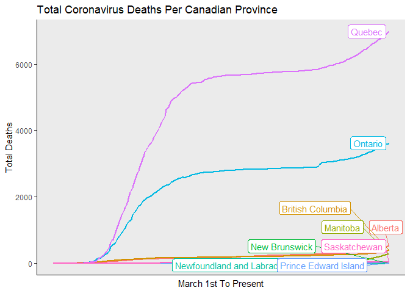
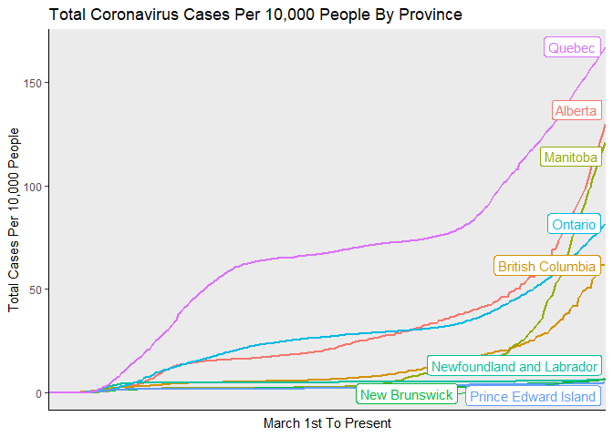
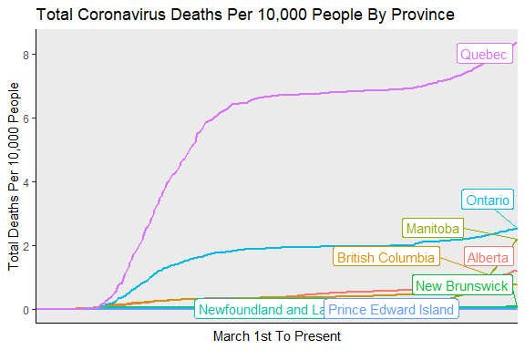
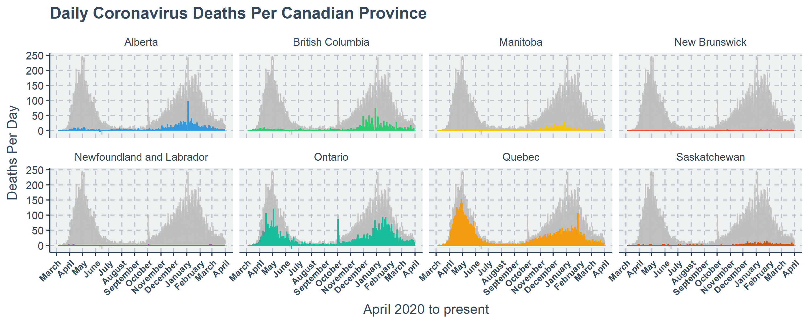

COVID-19 Canadian Data: Pre-processing And Simple Visualizations
================
Stephen Pierzchajlo

Here I’ll demonstrate how easy it is to set up a script that
automatically takes COVID-19 data for the entire world, reduces it to
only include regions you want, and then displays some simple figures
that include up-to-date cases and deaths. The data are not ready for
analysis straight away, so we need to get it in shape first. <br/>

Here, I will take worldwide COVID-19 data and make a script that,
whenever run, updates and displays COVID-19 data from Canada for cases
and deaths as recent as yesterday.

``` r
# Load libraries
library(tidyr)
library(ggplot2)
library(gghighlight)
library(plyr)
library(readr)
library(plotly)
library(ggpubr)
library(dplyr)
library(ggthemes)
library(hrbrthemes)
library(devtools)
#devtools::install_github('cttobin/ggthemr')
library(ggthemr)
library(kableExtra)
```

Their are different COVID-19 data repositories, and I am using one that
links to different worldwide *.csv* files. Each file contains data about
total worldwide cases and total worldwide deaths up until 24 hours ago.
Each time the code chunk below is run, it grabs an updated *.csv* file
from github. This is ideal, because it means anyone can use the code in
this tutorial to download a dataset and plot the same results.

``` r
# Here, we load .csv files from github. These are updated daily, so everytime this analysis is run, it uses the most up to date information.

# Total Global Cases Data
COVID_Global_Wide<-read_csv(url("https://raw.githubusercontent.com/CSSEGISandData/COVID-19/master/csse_covid_19_data/csse_covid_19_time_series/time_series_covid19_confirmed_global.csv"))

# Total Global Deaths Data
COVID_Global_Deaths_Wide <-read_csv(url("https://raw.githubusercontent.com/CSSEGISandData/COVID-19/master/csse_covid_19_data/csse_covid_19_time_series/time_series_covid19_deaths_global.csv"))
```

As seen below, the *.csv* file has been arranged such that each column
is a date, with the value in a cell corresponding to the total cases up
until that point in time. This format is not easy to work with, and it
means a new column will appear every day. After 1 week this dataframe
will have 7 more columns.

``` r
# Display first 10 rows and all columns.
COVID_Global_Wide[1:10, ]
```

    ## # A tibble: 10 x 438
    ##    `Province/State`  `Country/Region`   Lat   Long `1/22/20` `1/23/20` `1/24/20`
    ##    <chr>             <chr>            <dbl>  <dbl>     <dbl>     <dbl>     <dbl>
    ##  1 <NA>              Afghanistan       33.9  67.7          0         0         0
    ##  2 <NA>              Albania           41.2  20.2          0         0         0
    ##  3 <NA>              Algeria           28.0   1.66         0         0         0
    ##  4 <NA>              Andorra           42.5   1.52         0         0         0
    ##  5 <NA>              Angola           -11.2  17.9          0         0         0
    ##  6 <NA>              Antigua and Bar~  17.1 -61.8          0         0         0
    ##  7 <NA>              Argentina        -38.4 -63.6          0         0         0
    ##  8 <NA>              Armenia           40.1  45.0          0         0         0
    ##  9 Australian Capit~ Australia        -35.5 149.           0         0         0
    ## 10 New South Wales   Australia        -33.9 151.           0         0         0
    ## # ... with 431 more variables: 1/25/20 <dbl>, 1/26/20 <dbl>, 1/27/20 <dbl>,
    ## #   1/28/20 <dbl>, 1/29/20 <dbl>, 1/30/20 <dbl>, 1/31/20 <dbl>, 2/1/20 <dbl>,
    ## #   2/2/20 <dbl>, 2/3/20 <dbl>, 2/4/20 <dbl>, 2/5/20 <dbl>, 2/6/20 <dbl>,
    ## #   2/7/20 <dbl>, 2/8/20 <dbl>, 2/9/20 <dbl>, 2/10/20 <dbl>, 2/11/20 <dbl>,
    ## #   2/12/20 <dbl>, 2/13/20 <dbl>, 2/14/20 <dbl>, 2/15/20 <dbl>, 2/16/20 <dbl>,
    ## #   2/17/20 <dbl>, 2/18/20 <dbl>, 2/19/20 <dbl>, 2/20/20 <dbl>, 2/21/20 <dbl>,
    ## #   2/22/20 <dbl>, 2/23/20 <dbl>, 2/24/20 <dbl>, 2/25/20 <dbl>, 2/26/20 <dbl>,
    ## #   2/27/20 <dbl>, 2/28/20 <dbl>, 2/29/20 <dbl>, 3/1/20 <dbl>, 3/2/20 <dbl>,
    ## #   3/3/20 <dbl>, 3/4/20 <dbl>, 3/5/20 <dbl>, 3/6/20 <dbl>, 3/7/20 <dbl>,
    ## #   3/8/20 <dbl>, 3/9/20 <dbl>, 3/10/20 <dbl>, 3/11/20 <dbl>, 3/12/20 <dbl>,
    ## #   3/13/20 <dbl>, 3/14/20 <dbl>, 3/15/20 <dbl>, 3/16/20 <dbl>, 3/17/20 <dbl>,
    ## #   3/18/20 <dbl>, 3/19/20 <dbl>, 3/20/20 <dbl>, 3/21/20 <dbl>, 3/22/20 <dbl>,
    ## #   3/23/20 <dbl>, 3/24/20 <dbl>, 3/25/20 <dbl>, 3/26/20 <dbl>, 3/27/20 <dbl>,
    ## #   3/28/20 <dbl>, 3/29/20 <dbl>, 3/30/20 <dbl>, 3/31/20 <dbl>, 4/1/20 <dbl>,
    ## #   4/2/20 <dbl>, 4/3/20 <dbl>, 4/4/20 <dbl>, 4/5/20 <dbl>, 4/6/20 <dbl>,
    ## #   4/7/20 <dbl>, 4/8/20 <dbl>, 4/9/20 <dbl>, 4/10/20 <dbl>, 4/11/20 <dbl>,
    ## #   4/12/20 <dbl>, 4/13/20 <dbl>, 4/14/20 <dbl>, 4/15/20 <dbl>, 4/16/20 <dbl>,
    ## #   4/17/20 <dbl>, 4/18/20 <dbl>, 4/19/20 <dbl>, 4/20/20 <dbl>, 4/21/20 <dbl>,
    ## #   4/22/20 <dbl>, 4/23/20 <dbl>, 4/24/20 <dbl>, 4/25/20 <dbl>, 4/26/20 <dbl>,
    ## #   4/27/20 <dbl>, 4/28/20 <dbl>, 4/29/20 <dbl>, 4/30/20 <dbl>, 5/1/20 <dbl>,
    ## #   5/2/20 <dbl>, 5/3/20 <dbl>, ...

To make the data easier to work with, we can instead create one column
called “date”, and put each date from each column in it. Now instead of
100s of columns that contain dates, we only have one column.

``` r
# Total global cases data in long format.
COVID_Global_Long_Date <- gather(COVID_Global_Wide, date, cases, 5:ncol(COVID_Global_Wide), factor_key=TRUE)

# Total global deaths data in long format
COVID_Global_Deaths_Long_Date <- gather(COVID_Global_Deaths_Wide, date, cases, 5:ncol(COVID_Global_Deaths_Wide), factor_key=TRUE)

# Take a look at several of the first rows.
head(COVID_Global_Long_Date)
```

    ## # A tibble: 6 x 6
    ##   `Province/State` `Country/Region`      Lat   Long date    cases
    ##   <chr>            <chr>               <dbl>  <dbl> <fct>   <dbl>
    ## 1 <NA>             Afghanistan          33.9  67.7  1/22/20     0
    ## 2 <NA>             Albania              41.2  20.2  1/22/20     0
    ## 3 <NA>             Algeria              28.0   1.66 1/22/20     0
    ## 4 <NA>             Andorra              42.5   1.52 1/22/20     0
    ## 5 <NA>             Angola              -11.2  17.9  1/22/20     0
    ## 6 <NA>             Antigua and Barbuda  17.1 -61.8  1/22/20     0

Because I only want data from Canada, I need to filter out every other
country. Additionally, I’ll remove Canadian territories too as there are
not too many people who live there. We will do this for both the cases
and deaths dataframes.

``` r
kable(table(COVID_Global_Long_Date$`Province/State`)) %>%
  kable_styling("striped") %>%
  scroll_box(width = "100%")
```

<div style="border: 1px solid #ddd; padding: 5px; overflow-x: scroll; width:100%; ">

<table class="table table-striped" style="margin-left: auto; margin-right: auto;">

<thead>

<tr>

<th style="text-align:left;">

Var1

</th>

<th style="text-align:right;">

Freq

</th>

</tr>

</thead>

<tbody>

<tr>

<td style="text-align:left;">

Alberta

</td>

<td style="text-align:right;">

434

</td>

</tr>

<tr>

<td style="text-align:left;">

Anguilla

</td>

<td style="text-align:right;">

434

</td>

</tr>

<tr>

<td style="text-align:left;">

Anhui

</td>

<td style="text-align:right;">

434

</td>

</tr>

<tr>

<td style="text-align:left;">

Aruba

</td>

<td style="text-align:right;">

434

</td>

</tr>

<tr>

<td style="text-align:left;">

Australian Capital Territory

</td>

<td style="text-align:right;">

434

</td>

</tr>

<tr>

<td style="text-align:left;">

Beijing

</td>

<td style="text-align:right;">

434

</td>

</tr>

<tr>

<td style="text-align:left;">

Bermuda

</td>

<td style="text-align:right;">

434

</td>

</tr>

<tr>

<td style="text-align:left;">

Bonaire, Sint Eustatius and Saba

</td>

<td style="text-align:right;">

434

</td>

</tr>

<tr>

<td style="text-align:left;">

British Columbia

</td>

<td style="text-align:right;">

434

</td>

</tr>

<tr>

<td style="text-align:left;">

British Virgin Islands

</td>

<td style="text-align:right;">

434

</td>

</tr>

<tr>

<td style="text-align:left;">

Cayman Islands

</td>

<td style="text-align:right;">

434

</td>

</tr>

<tr>

<td style="text-align:left;">

Channel Islands

</td>

<td style="text-align:right;">

434

</td>

</tr>

<tr>

<td style="text-align:left;">

Chongqing

</td>

<td style="text-align:right;">

434

</td>

</tr>

<tr>

<td style="text-align:left;">

Curacao

</td>

<td style="text-align:right;">

434

</td>

</tr>

<tr>

<td style="text-align:left;">

Diamond Princess

</td>

<td style="text-align:right;">

434

</td>

</tr>

<tr>

<td style="text-align:left;">

Falkland Islands (Malvinas)

</td>

<td style="text-align:right;">

434

</td>

</tr>

<tr>

<td style="text-align:left;">

Faroe Islands

</td>

<td style="text-align:right;">

434

</td>

</tr>

<tr>

<td style="text-align:left;">

French Guiana

</td>

<td style="text-align:right;">

434

</td>

</tr>

<tr>

<td style="text-align:left;">

French Polynesia

</td>

<td style="text-align:right;">

434

</td>

</tr>

<tr>

<td style="text-align:left;">

Fujian

</td>

<td style="text-align:right;">

434

</td>

</tr>

<tr>

<td style="text-align:left;">

Gansu

</td>

<td style="text-align:right;">

434

</td>

</tr>

<tr>

<td style="text-align:left;">

Gibraltar

</td>

<td style="text-align:right;">

434

</td>

</tr>

<tr>

<td style="text-align:left;">

Grand Princess

</td>

<td style="text-align:right;">

434

</td>

</tr>

<tr>

<td style="text-align:left;">

Greenland

</td>

<td style="text-align:right;">

434

</td>

</tr>

<tr>

<td style="text-align:left;">

Guadeloupe

</td>

<td style="text-align:right;">

434

</td>

</tr>

<tr>

<td style="text-align:left;">

Guangdong

</td>

<td style="text-align:right;">

434

</td>

</tr>

<tr>

<td style="text-align:left;">

Guangxi

</td>

<td style="text-align:right;">

434

</td>

</tr>

<tr>

<td style="text-align:left;">

Guizhou

</td>

<td style="text-align:right;">

434

</td>

</tr>

<tr>

<td style="text-align:left;">

Hainan

</td>

<td style="text-align:right;">

434

</td>

</tr>

<tr>

<td style="text-align:left;">

Hebei

</td>

<td style="text-align:right;">

434

</td>

</tr>

<tr>

<td style="text-align:left;">

Heilongjiang

</td>

<td style="text-align:right;">

434

</td>

</tr>

<tr>

<td style="text-align:left;">

Henan

</td>

<td style="text-align:right;">

434

</td>

</tr>

<tr>

<td style="text-align:left;">

Hong Kong

</td>

<td style="text-align:right;">

434

</td>

</tr>

<tr>

<td style="text-align:left;">

Hubei

</td>

<td style="text-align:right;">

434

</td>

</tr>

<tr>

<td style="text-align:left;">

Hunan

</td>

<td style="text-align:right;">

434

</td>

</tr>

<tr>

<td style="text-align:left;">

Inner Mongolia

</td>

<td style="text-align:right;">

434

</td>

</tr>

<tr>

<td style="text-align:left;">

Isle of Man

</td>

<td style="text-align:right;">

434

</td>

</tr>

<tr>

<td style="text-align:left;">

Jiangsu

</td>

<td style="text-align:right;">

434

</td>

</tr>

<tr>

<td style="text-align:left;">

Jiangxi

</td>

<td style="text-align:right;">

434

</td>

</tr>

<tr>

<td style="text-align:left;">

Jilin

</td>

<td style="text-align:right;">

434

</td>

</tr>

<tr>

<td style="text-align:left;">

Liaoning

</td>

<td style="text-align:right;">

434

</td>

</tr>

<tr>

<td style="text-align:left;">

Macau

</td>

<td style="text-align:right;">

434

</td>

</tr>

<tr>

<td style="text-align:left;">

Manitoba

</td>

<td style="text-align:right;">

434

</td>

</tr>

<tr>

<td style="text-align:left;">

Martinique

</td>

<td style="text-align:right;">

434

</td>

</tr>

<tr>

<td style="text-align:left;">

Mayotte

</td>

<td style="text-align:right;">

434

</td>

</tr>

<tr>

<td style="text-align:left;">

Montserrat

</td>

<td style="text-align:right;">

434

</td>

</tr>

<tr>

<td style="text-align:left;">

New Brunswick

</td>

<td style="text-align:right;">

434

</td>

</tr>

<tr>

<td style="text-align:left;">

New Caledonia

</td>

<td style="text-align:right;">

434

</td>

</tr>

<tr>

<td style="text-align:left;">

New South Wales

</td>

<td style="text-align:right;">

434

</td>

</tr>

<tr>

<td style="text-align:left;">

Newfoundland and Labrador

</td>

<td style="text-align:right;">

434

</td>

</tr>

<tr>

<td style="text-align:left;">

Ningxia

</td>

<td style="text-align:right;">

434

</td>

</tr>

<tr>

<td style="text-align:left;">

Northern Territory

</td>

<td style="text-align:right;">

434

</td>

</tr>

<tr>

<td style="text-align:left;">

Northwest Territories

</td>

<td style="text-align:right;">

434

</td>

</tr>

<tr>

<td style="text-align:left;">

Nova Scotia

</td>

<td style="text-align:right;">

434

</td>

</tr>

<tr>

<td style="text-align:left;">

Nunavut

</td>

<td style="text-align:right;">

434

</td>

</tr>

<tr>

<td style="text-align:left;">

Ontario

</td>

<td style="text-align:right;">

434

</td>

</tr>

<tr>

<td style="text-align:left;">

Prince Edward Island

</td>

<td style="text-align:right;">

434

</td>

</tr>

<tr>

<td style="text-align:left;">

Qinghai

</td>

<td style="text-align:right;">

434

</td>

</tr>

<tr>

<td style="text-align:left;">

Quebec

</td>

<td style="text-align:right;">

434

</td>

</tr>

<tr>

<td style="text-align:left;">

Queensland

</td>

<td style="text-align:right;">

434

</td>

</tr>

<tr>

<td style="text-align:left;">

Repatriated Travellers

</td>

<td style="text-align:right;">

434

</td>

</tr>

<tr>

<td style="text-align:left;">

Reunion

</td>

<td style="text-align:right;">

434

</td>

</tr>

<tr>

<td style="text-align:left;">

Saint Barthelemy

</td>

<td style="text-align:right;">

434

</td>

</tr>

<tr>

<td style="text-align:left;">

Saint Helena, Ascension and Tristan da Cunha

</td>

<td style="text-align:right;">

434

</td>

</tr>

<tr>

<td style="text-align:left;">

Saint Pierre and Miquelon

</td>

<td style="text-align:right;">

434

</td>

</tr>

<tr>

<td style="text-align:left;">

Saskatchewan

</td>

<td style="text-align:right;">

434

</td>

</tr>

<tr>

<td style="text-align:left;">

Shaanxi

</td>

<td style="text-align:right;">

434

</td>

</tr>

<tr>

<td style="text-align:left;">

Shandong

</td>

<td style="text-align:right;">

434

</td>

</tr>

<tr>

<td style="text-align:left;">

Shanghai

</td>

<td style="text-align:right;">

434

</td>

</tr>

<tr>

<td style="text-align:left;">

Shanxi

</td>

<td style="text-align:right;">

434

</td>

</tr>

<tr>

<td style="text-align:left;">

Sichuan

</td>

<td style="text-align:right;">

434

</td>

</tr>

<tr>

<td style="text-align:left;">

Sint Maarten

</td>

<td style="text-align:right;">

434

</td>

</tr>

<tr>

<td style="text-align:left;">

South Australia

</td>

<td style="text-align:right;">

434

</td>

</tr>

<tr>

<td style="text-align:left;">

St Martin

</td>

<td style="text-align:right;">

434

</td>

</tr>

<tr>

<td style="text-align:left;">

Tasmania

</td>

<td style="text-align:right;">

434

</td>

</tr>

<tr>

<td style="text-align:left;">

Tianjin

</td>

<td style="text-align:right;">

434

</td>

</tr>

<tr>

<td style="text-align:left;">

Tibet

</td>

<td style="text-align:right;">

434

</td>

</tr>

<tr>

<td style="text-align:left;">

Turks and Caicos Islands

</td>

<td style="text-align:right;">

434

</td>

</tr>

<tr>

<td style="text-align:left;">

Victoria

</td>

<td style="text-align:right;">

434

</td>

</tr>

<tr>

<td style="text-align:left;">

Wallis and Futuna

</td>

<td style="text-align:right;">

434

</td>

</tr>

<tr>

<td style="text-align:left;">

Western Australia

</td>

<td style="text-align:right;">

434

</td>

</tr>

<tr>

<td style="text-align:left;">

Xinjiang

</td>

<td style="text-align:right;">

434

</td>

</tr>

<tr>

<td style="text-align:left;">

Yukon

</td>

<td style="text-align:right;">

434

</td>

</tr>

<tr>

<td style="text-align:left;">

Yunnan

</td>

<td style="text-align:right;">

434

</td>

</tr>

<tr>

<td style="text-align:left;">

Zhejiang

</td>

<td style="text-align:right;">

434

</td>

</tr>

</tbody>

</table>

</div>

``` r
### SUBSETTING

# Subset Canadian provinces from total cumulative global cases data.
Covid_Canada <- subset(COVID_Global_Long_Date, `Country/Region` == "Canada")

# Subset Canadian provinces from total cumulative global deaths data.
Covid_Canada_Deaths <- subset(COVID_Global_Deaths_Long_Date, `Country/Region` == "Canada")
```

``` r
kable(table(Covid_Canada$`Province/State`))  %>%
  kable_styling("striped") %>%
  scroll_box(width = "100%")
```

<div style="border: 1px solid #ddd; padding: 5px; overflow-x: scroll; width:100%; ">

<table class="table table-striped" style="margin-left: auto; margin-right: auto;">

<thead>

<tr>

<th style="text-align:left;">

Var1

</th>

<th style="text-align:right;">

Freq

</th>

</tr>

</thead>

<tbody>

<tr>

<td style="text-align:left;">

Alberta

</td>

<td style="text-align:right;">

434

</td>

</tr>

<tr>

<td style="text-align:left;">

British Columbia

</td>

<td style="text-align:right;">

434

</td>

</tr>

<tr>

<td style="text-align:left;">

Diamond Princess

</td>

<td style="text-align:right;">

434

</td>

</tr>

<tr>

<td style="text-align:left;">

Grand Princess

</td>

<td style="text-align:right;">

434

</td>

</tr>

<tr>

<td style="text-align:left;">

Manitoba

</td>

<td style="text-align:right;">

434

</td>

</tr>

<tr>

<td style="text-align:left;">

New Brunswick

</td>

<td style="text-align:right;">

434

</td>

</tr>

<tr>

<td style="text-align:left;">

Newfoundland and Labrador

</td>

<td style="text-align:right;">

434

</td>

</tr>

<tr>

<td style="text-align:left;">

Northwest Territories

</td>

<td style="text-align:right;">

434

</td>

</tr>

<tr>

<td style="text-align:left;">

Nova Scotia

</td>

<td style="text-align:right;">

434

</td>

</tr>

<tr>

<td style="text-align:left;">

Nunavut

</td>

<td style="text-align:right;">

434

</td>

</tr>

<tr>

<td style="text-align:left;">

Ontario

</td>

<td style="text-align:right;">

434

</td>

</tr>

<tr>

<td style="text-align:left;">

Prince Edward Island

</td>

<td style="text-align:right;">

434

</td>

</tr>

<tr>

<td style="text-align:left;">

Quebec

</td>

<td style="text-align:right;">

434

</td>

</tr>

<tr>

<td style="text-align:left;">

Repatriated Travellers

</td>

<td style="text-align:right;">

434

</td>

</tr>

<tr>

<td style="text-align:left;">

Saskatchewan

</td>

<td style="text-align:right;">

434

</td>

</tr>

<tr>

<td style="text-align:left;">

Yukon

</td>

<td style="text-align:right;">

434

</td>

</tr>

</tbody>

</table>

</div>

``` r
### FILTERING

# For province data, I'm not immediately interested in Canadian Territories, so I'll filter those out.
Covid_Canada_Filter <- Covid_Canada %>% dplyr::filter(`Province/State` %in% c("Ontario", "Quebec", "New Brunswick", "Manitoba", "British Columbia", "Saskatchewan", "Alberta", "Newfoundland and Labrador"))

# For province data, I'm not immediately interested in Canadian Territories, so I'll filter those out.
Covid_Canada_Deaths_Filter <- Covid_Canada_Deaths %>% dplyr::filter(`Province/State` %in% c("Ontario", "Quebec", "New Brunswick", "Manitoba", "British Columbia", "Saskatchewan", "Alberta", "Newfoundland and Labrador"))
```

``` r
kable(table(Covid_Canada$`Province/State`)) %>%
  kable_styling("striped") %>%
  scroll_box(width = "100%")
```

<div style="border: 1px solid #ddd; padding: 5px; overflow-x: scroll; width:100%; ">

<table class="table table-striped" style="margin-left: auto; margin-right: auto;">

<thead>

<tr>

<th style="text-align:left;">

Var1

</th>

<th style="text-align:right;">

Freq

</th>

</tr>

</thead>

<tbody>

<tr>

<td style="text-align:left;">

Alberta

</td>

<td style="text-align:right;">

434

</td>

</tr>

<tr>

<td style="text-align:left;">

British Columbia

</td>

<td style="text-align:right;">

434

</td>

</tr>

<tr>

<td style="text-align:left;">

Diamond Princess

</td>

<td style="text-align:right;">

434

</td>

</tr>

<tr>

<td style="text-align:left;">

Grand Princess

</td>

<td style="text-align:right;">

434

</td>

</tr>

<tr>

<td style="text-align:left;">

Manitoba

</td>

<td style="text-align:right;">

434

</td>

</tr>

<tr>

<td style="text-align:left;">

New Brunswick

</td>

<td style="text-align:right;">

434

</td>

</tr>

<tr>

<td style="text-align:left;">

Newfoundland and Labrador

</td>

<td style="text-align:right;">

434

</td>

</tr>

<tr>

<td style="text-align:left;">

Northwest Territories

</td>

<td style="text-align:right;">

434

</td>

</tr>

<tr>

<td style="text-align:left;">

Nova Scotia

</td>

<td style="text-align:right;">

434

</td>

</tr>

<tr>

<td style="text-align:left;">

Nunavut

</td>

<td style="text-align:right;">

434

</td>

</tr>

<tr>

<td style="text-align:left;">

Ontario

</td>

<td style="text-align:right;">

434

</td>

</tr>

<tr>

<td style="text-align:left;">

Prince Edward Island

</td>

<td style="text-align:right;">

434

</td>

</tr>

<tr>

<td style="text-align:left;">

Quebec

</td>

<td style="text-align:right;">

434

</td>

</tr>

<tr>

<td style="text-align:left;">

Repatriated Travellers

</td>

<td style="text-align:right;">

434

</td>

</tr>

<tr>

<td style="text-align:left;">

Saskatchewan

</td>

<td style="text-align:right;">

434

</td>

</tr>

<tr>

<td style="text-align:left;">

Yukon

</td>

<td style="text-align:right;">

434

</td>

</tr>

</tbody>

</table>

</div>

Let’s also filter dates earlier than March 1st 2020, and convert the
dates column to a dates dataframe object.

``` r
# Filter canadian provincial data to only include data starting from March 1st.
Covid_Canada_Filter <- Covid_Canada_Filter[352:nrow(Covid_Canada_Filter), ]
# Filter canadian provincial deaths data to only include data starting from March 1st.
Covid_Canada_Deaths_Filter <- Covid_Canada_Deaths_Filter[352:nrow(Covid_Canada_Deaths_Filter), ]

# Convert date column to date format for cases dataframe.
Covid_Canada_Filter$date <- as.Date(Covid_Canada_Filter$date, format = "%m/%d/%Y")
# Convert date column to date format for deaths dataframe.
Covid_Canada_Deaths_Filter$date <- as.Date(Covid_Canada_Deaths_Filter$date, format = "%m/%d/%Y")
```

``` r
# Template for canadian provincial data cleaned for graphing.
Covid_Canada_Graph <- ddply(Covid_Canada_Filter, c("`Province/State`", "date"), summarise,
                            mean = sum(cases))

# Template for canadian provincial deaths data cleaned for graphing.
Covid_Canada_Deaths_Graph <- ddply(Covid_Canada_Deaths_Filter, c("`Province/State`", "date"),
                                   summarise, mean = sum(cases))

# Fit data to logarithmic scale.
Covid_Canada_Graph$logcases <- log(Covid_Canada_Graph$mean)

# Order dates so they appear in order on the graph.
Covid_Canada_Deaths_Graph$logcases <- log(Covid_Canada_Deaths_Graph$mean)
```

``` r
# Add a column to total cases graph template indicating the data are for total cases.
Covid_Canada_Graph$Graph <- "Total Cases"

# Add a column to total deaths graph template indicating the data are for total deaths.
Covid_Canada_Deaths_Graph$Graph <- "Total Deaths"
```

``` r
COVID_Canada_Final <- Covid_Canada_Graph
colnames(COVID_Canada_Final) <- c("Province/State", "Date", "Cumulative_Cases", "Cumulative_LogCases", "Graph")
COVID_Canada_Final[,c("Graph")] <- list(NULL)
COVID_Canada_Final$Cumulative_Deaths  <- Covid_Canada_Deaths_Graph$mean
COVID_Canada_Final$Cumulative_LogDeaths  <- Covid_Canada_Deaths_Graph$logcases
COVID_Canada_Final$DailyCases <- ave(COVID_Canada_Final$Cumulative_Cases,COVID_Canada_Final$`Province/State`,  FUN=function(x) c(0, diff(x)))

COVID_Canada_Final$DailyDeaths <- ave(COVID_Canada_Final$Cumulative_Deaths,COVID_Canada_Final$`Province/State`,  FUN=function(x) c(0, diff(x)))
```

``` r
# For total cases, change scale to see total cases per 10,000 people.
COVID_Canada_Final$Cases_Per100000 <- ifelse(COVID_Canada_Final$`Province/State` == "Alberta",
                                      (COVID_Canada_Final$Cumulative_Cases/4345737) * 100000,
                                ifelse(COVID_Canada_Final$`Province/State` == "British Columbia",
                                      (COVID_Canada_Final$Cumulative_Cases/5020302) * 100000,
                                ifelse(COVID_Canada_Final$`Province/State` == "Manitoba",
                                      (COVID_Canada_Final$Cumulative_Cases/1360396) * 100000,
                                ifelse(COVID_Canada_Final$`Province/State` == "New Brunswick",
                                      (COVID_Canada_Final$Cumulative_Cases/772094) * 100000,
                                ifelse(COVID_Canada_Final$`Province/State` == "Newfoundland and Labrador",
                                      (COVID_Canada_Final$Cumulative_Cases/523790) * 100000,
                                ifelse(COVID_Canada_Final$`Province/State` == "Ontario",
                                      (COVID_Canada_Final$Cumulative_Cases/14446515) * 100000,
                                ifelse(COVID_Canada_Final$`Province/State` == "Quebec",
                                      (COVID_Canada_Final$Cumulative_Cases/8433301) * 100000,
                                ifelse(COVID_Canada_Final$`Province/State` == "Saskatchewan ",
                                      (COVID_Canada_Final$Cumulative_Cases/1168423) * 100000,
                                                                              "NA"))))))))

# Change per 10,000 people column to numeric.
COVID_Canada_Final$Cases_Per100000 <- as.numeric(COVID_Canada_Final$Cases_Per100000)
```

``` r
# For total deaths, change scale to see total cases per 10,000 people.
COVID_Canada_Final$Deaths_Per100000 <- ifelse(COVID_Canada_Final$`Province/State` == "Alberta",
                                      (COVID_Canada_Final$Cumulative_Deaths/4345737) * 100000,
                                ifelse(COVID_Canada_Final$`Province/State` == "British Columbia",
                                      (COVID_Canada_Final$Cumulative_Deaths/5020302) * 100000,
                                ifelse(COVID_Canada_Final$`Province/State` == "Manitoba",
                                      (COVID_Canada_Final$Cumulative_Deaths/1360396) * 100000,
                                ifelse(COVID_Canada_Final$`Province/State` == "New Brunswick",
                                      (COVID_Canada_Final$Cumulative_Deaths/772094) * 100000,
                            ifelse(COVID_Canada_Final$`Province/State` == "Newfoundland and Labrador",
                                      (COVID_Canada_Final$Cumulative_Deaths/523790) * 100000,
                                ifelse(COVID_Canada_Final$`Province/State` == "Ontario",
                                      (COVID_Canada_Final$Cumulative_Deaths/14446515) * 100000,
                                ifelse(COVID_Canada_Final$`Province/State` == "Quebec",
                                      (COVID_Canada_Final$Cumulative_Deaths/8433301) * 100000,
                                ifelse(COVID_Canada_Final$`Province/State` == "Saskatchewan ",
                                      (COVID_Canada_Final$Cumulative_Deaths/1168423) * 100000,
                                                                              "NA"))))))))

# Change per 10,000 people column to numeric.
COVID_Canada_Final$Deaths_Per100000 <- as.numeric(COVID_Canada_Final$Deaths_Per100000)
```

``` r
COVID_Canada_Final$month <- months(as.POSIXlt(COVID_Canada_Final$Date, format="%d/%m/%Y"))
```

``` r
#ggthemr("light")
ggthemr("flat")
# Total cases graph.
Total_Cases <- ggplot(COVID_Canada_Final, aes(x = Date, y = Cases_Per100000, color = `Province/State`, group = `Province/State`, fill = `Province/State`)) +
  geom_area() +
  labs(x = "March 1st (2020) To Present",
       y = "Cumulative Cases Per 100,000 People",
       title = "Coronavirus Cases Per Canadian Province",
       caption = "Data source: Government of Canada") +
  scale_colour_ggthemr_d() +
  scale_x_date(date_breaks = '1 month',
        date_labels = '%B') +
  theme(axis.text.x = element_text(face = "bold", 
                           size = 9, angle = 45, hjust = 1)) +
  theme(plot.title = element_text(hjust = 0.5))
  #theme(legend.background = element_rect(fill="lightgrey",
  #                                size=0.6))# +
  #gghighlight()

Total_Cases
```

<!-- -->

``` r
ggthemr_reset()
```

``` r
#ggthemr("light")
ggthemr("flat")
# Total cases graph.
Total_Deaths <- ggplot(COVID_Canada_Final, aes(x = Date, y = Deaths_Per100000, color = `Province/State`, group = `Province/State`, fill = `Province/State`)) +
  geom_area() +
  labs(x = "March 1st (2020) To Present",
       y = "Cumulative Deaths Per 100,000 People",
       title = "Coronavirus Deaths Per Canadian Province",
       caption = "Data source: Government of Canada") +
  scale_colour_ggthemr_d() +
  scale_x_date(date_breaks = '1 month',
        date_labels = '%B') +
  theme(axis.text.x = element_text(face = "bold", 
                           size = 9, angle = 45, hjust = 1)) +
  theme(plot.title = element_text(hjust = 0.5))
  #theme(legend.background = element_rect(fill="lightgrey",
  #                                size=0.6))# +
  #gghighlight()

Total_Deaths
```

<!-- -->

``` r
ggthemr_reset()
```

``` r
Covid_Canada_Graph$diff <- ave(Covid_Canada_Graph$mean,Covid_Canada_Graph$`Province/State`,  FUN=function(x) c(0, diff(x)))
Covid_Canada_Deaths_Graph$diff <- ave(Covid_Canada_Deaths_Graph$mean,Covid_Canada_Graph$`Province/State`,  FUN=function(x) c(0, diff(x)))
```

``` r
#ggthemr("dust")
#ggthemr("light")
ggthemr("flat")
# Total cases graph.
Total_Cases_Hist <- ggplot(COVID_Canada_Final, aes(x = Date, y = DailyCases, color = `Province/State`, group = `Province/State`, fill = `Province/State`)) +
  geom_bar(stat = "identity") +
  facet_wrap(~`Province/State`, nrow = 2, ncol = 4) +
  ylab("Cases Per Day") +
  xlab("March 1st (2020) To Present") +
  ggtitle("Daily Coronavirus Cases Per Canadian Province")+
  scale_colour_ggthemr_d() +
  scale_x_date(name = 'April 2020 to present', date_breaks = '1 month',
        date_labels = '%B') +
  theme(axis.text.x = element_text(face = "bold", 
                           size = 8, angle = 45, hjust = 1)) +
  gghighlight()

Total_Cases_Hist
```

<!-- -->

``` r
ggthemr("flat")
Total_Cases_Hist <- ggplot(COVID_Canada_Final, aes(x = Date, y = DailyDeaths, color = `Province/State`, group = `Province/State`, fill = `Province/State`)) +
  geom_bar(stat = "identity") +
  facet_wrap(~`Province/State`, nrow = 2, ncol = 4) +
  ylab("Deaths Per Day") +
  xlab("March 1st (2020) To Present") +
  ggtitle("Daily Coronavirus Deaths Per Canadian Province")+
  scale_colour_ggthemr_d() +
  scale_x_date(name = 'April 2020 to present', date_breaks = '1 month',
        date_labels = '%B') +
  theme(axis.text.x = element_text(face = "bold", 
                           size = 8, angle = 45, hjust = 1)) +
  gghighlight()

Total_Cases_Hist
```

<!-- -->
