COVID-19 Canadian data: pre-processing, visualizations, and modelling
================
Stephen Pierzchajlo

# Introduction

I have used R for a few years now, and every project I am currently
working on has a completed R script already made. Therefore, it didn’t
make sense to me to just redo my analyses. I decided I wanted to do
something new for this course, and do something I had never done before.
One aspect of programming that I never was comfortable with was writing
functions. So the ultimate goal of this project is to write functions
that will perform an entire analysis in an interesting way, while still
staying within the parameters of the assignment.

## My project idea

Many months ago I analysed data for a paper on COVID-19. The paper is
currently under review, but all analyses, data, and scripts can be found
here: <https://osf.io/c8zhn/>. Part of my work involved getting COVID-19
infection rate data for 4 specific weeks in March/April to use as a
random effects parameter in a multiple regression model. The specific
COVID-19 repository I found gets updated daily and contains data for
every country (and every sub-region in that country) in the world. I
thought it would be interesting to create a set of functions that could
analyse any country the user chooses in a variety of ways, and output
COVID-19 related statistics and visualisations of infection trends. So
that is the ultimate goal of this project.

<br/>

In this project, I will first analyse COVID-19 data for 1 country in
great detail, and then ultimately automate these analyses with a number
of functions that generalise across any country the user wants. Because
I am Canadian, I decided to first analyse Canadian COVID-19 data in as
much detail as possible. This will include downloading the data from a
specific source, wrangling it into a condensed dataframe, graphing the
data in various ways, and even doing some basic modelling to predict
future infection rates.

# Preparations

Here is how I typically start any R project.

## Remove global environment

I typically remove the global environment everytime I work on a project.

``` r
# This function removes the entire global environment!!!
rm(list = ls())
```

<br/>

## Load libraries

Below is a list of libraries I will use. I comment on each one to
indicate what they will be used for.

``` r
# Load libraries.

# Contains all tidyverse function for data wrangling and graphing.
library(tidyverse)

# Used for graphing daily COVID-19 infections.
library(gghighlight)

# Summarising data into condensed dataframe.
library(plyr)

# Theme for ggplot that I like.
#devtools::install_github('Mikata-Project/ggthemr')
library(ggthemr)

# THe ggarrange function plots multiple graphs.
library(ggpubr)

# Display coefficients for predictive models.
library(broom)

# Create documentation for functions.
#library(docstring)
```

<br/>

# Data wrangling

## Finding a COVID-19 repository

Their are many different COVID-19 data repositories, and I am using two
files that contains COVID-19 data for every country in the world. File 1
contains data about total worldwide cases and file 2 contains data about
total worldwide deaths. Each time the code chunk below is run, it grabs
each *.csv* file from a github repository that has been updated within
the past 24 hours. This is ideal, because it means that anytime I run
this script, I have COVID-19 statistics that are as recent as yesterday.
I prefer this approach to downloading a static *.csv* file because
COVID-19 cases and deaths are ongoing and constantly changing.

``` r
# Load .csv files from github. These are updated daily, so everytime this analysis is run, it uses the most up to date information.

# Load total global cases data.
COVID_Global_Wide <- read_csv(url("https://raw.githubusercontent.com/CSSEGISandData/COVID-19/master/csse_covid_19_data/csse_covid_19_time_series/time_series_covid19_confirmed_global.csv"))

# Load total global deaths data.
COVID_Global_Deaths_Wide <- read_csv(url("https://raw.githubusercontent.com/CSSEGISandData/COVID-19/master/csse_covid_19_data/csse_covid_19_time_series/time_series_covid19_deaths_global.csv"))
```

<br/>

## Quick look at raw data

First I’ll look at the overall shape of one of these dataframes, since I
already know they both have the same structure.

``` r
# Print number of rows and columns.
cat(" There are", nrow(COVID_Global_Wide), "rows in this dataframe.\n","There are", ncol(COVID_Global_Wide), "columns in this dataframe.")
```

    ##  There are 274 rows in this dataframe.
    ##  There are 452 columns in this dataframe.

There are a massive number of columns. Why is that? I decided to take a
look at the overall structure of one of the dataframes.

``` r
# Display first 10 rows and all columns.
COVID_Global_Wide[1:10, ]
```

    ## # A tibble: 10 x 452
    ##    `Province/State`  `Country/Region`   Lat   Long `1/22/20` `1/23/20` `1/24/20`
    ##    <chr>             <chr>            <dbl>  <dbl>     <dbl>     <dbl>     <dbl>
    ##  1 <NA>              Afghanistan       33.9  67.7          0         0         0
    ##  2 <NA>              Albania           41.2  20.2          0         0         0
    ##  3 <NA>              Algeria           28.0   1.66         0         0         0
    ##  4 <NA>              Andorra           42.5   1.52         0         0         0
    ##  5 <NA>              Angola           -11.2  17.9          0         0         0
    ##  6 <NA>              Antigua and Bar~  17.1 -61.8          0         0         0
    ##  7 <NA>              Argentina        -38.4 -63.6          0         0         0
    ##  8 <NA>              Armenia           40.1  45.0          0         0         0
    ##  9 Australian Capit~ Australia        -35.5 149.           0         0         0
    ## 10 New South Wales   Australia        -33.9 151.           0         0         0
    ## # ... with 445 more variables: 1/25/20 <dbl>, 1/26/20 <dbl>, 1/27/20 <dbl>,
    ## #   1/28/20 <dbl>, 1/29/20 <dbl>, 1/30/20 <dbl>, 1/31/20 <dbl>, 2/1/20 <dbl>,
    ## #   2/2/20 <dbl>, 2/3/20 <dbl>, 2/4/20 <dbl>, 2/5/20 <dbl>, 2/6/20 <dbl>,
    ## #   2/7/20 <dbl>, 2/8/20 <dbl>, 2/9/20 <dbl>, 2/10/20 <dbl>, 2/11/20 <dbl>,
    ## #   2/12/20 <dbl>, 2/13/20 <dbl>, 2/14/20 <dbl>, 2/15/20 <dbl>, 2/16/20 <dbl>,
    ## #   2/17/20 <dbl>, 2/18/20 <dbl>, 2/19/20 <dbl>, 2/20/20 <dbl>, 2/21/20 <dbl>,
    ## #   2/22/20 <dbl>, 2/23/20 <dbl>, 2/24/20 <dbl>, 2/25/20 <dbl>, 2/26/20 <dbl>,
    ## #   2/27/20 <dbl>, 2/28/20 <dbl>, 2/29/20 <dbl>, 3/1/20 <dbl>, 3/2/20 <dbl>,
    ## #   3/3/20 <dbl>, 3/4/20 <dbl>, 3/5/20 <dbl>, 3/6/20 <dbl>, 3/7/20 <dbl>,
    ## #   3/8/20 <dbl>, 3/9/20 <dbl>, 3/10/20 <dbl>, 3/11/20 <dbl>, 3/12/20 <dbl>,
    ## #   3/13/20 <dbl>, 3/14/20 <dbl>, 3/15/20 <dbl>, 3/16/20 <dbl>, 3/17/20 <dbl>,
    ## #   3/18/20 <dbl>, 3/19/20 <dbl>, 3/20/20 <dbl>, 3/21/20 <dbl>, 3/22/20 <dbl>,
    ## #   3/23/20 <dbl>, 3/24/20 <dbl>, 3/25/20 <dbl>, 3/26/20 <dbl>, 3/27/20 <dbl>,
    ## #   3/28/20 <dbl>, 3/29/20 <dbl>, 3/30/20 <dbl>, 3/31/20 <dbl>, 4/1/20 <dbl>,
    ## #   4/2/20 <dbl>, 4/3/20 <dbl>, 4/4/20 <dbl>, 4/5/20 <dbl>, 4/6/20 <dbl>,
    ## #   4/7/20 <dbl>, 4/8/20 <dbl>, 4/9/20 <dbl>, 4/10/20 <dbl>, 4/11/20 <dbl>,
    ## #   4/12/20 <dbl>, 4/13/20 <dbl>, 4/14/20 <dbl>, 4/15/20 <dbl>, 4/16/20 <dbl>,
    ## #   4/17/20 <dbl>, 4/18/20 <dbl>, 4/19/20 <dbl>, 4/20/20 <dbl>, 4/21/20 <dbl>,
    ## #   4/22/20 <dbl>, 4/23/20 <dbl>, 4/24/20 <dbl>, 4/25/20 <dbl>, 4/26/20 <dbl>,
    ## #   4/27/20 <dbl>, 4/28/20 <dbl>, 4/29/20 <dbl>, 4/30/20 <dbl>, 5/1/20 <dbl>,
    ## #   5/2/20 <dbl>, 5/3/20 <dbl>, ...

As seen above, the *.csv* file has been arranged such that each column
is a date (ignoring the first 4 columns), with values in a column
corresponding to the total cases/deaths up until that date. This format
is not easy to work with, and it means a new column will appear every
day. After 1 week this dataframe will have 7 more columns.

<br/>

## Reshaping dataframes

To make the data easier to work with, I will create one column called
“date” where each row is a date. In a column beside it, I will have
the total cases/deaths for that date. Now instead of 100s of columns
that contain dates, there is instead a single dates column.

``` r
# Total global cases data in long format.
COVID_Global_Long_Date <- gather(COVID_Global_Wide, date, cases, 5:ncol(COVID_Global_Wide), factor_key=TRUE)

# Total global deaths data in long format
COVID_Global_Deaths_Long_Date <- gather(COVID_Global_Deaths_Wide, date, cases, 5:ncol(COVID_Global_Deaths_Wide), factor_key=TRUE)
```

``` r
# Take a look at several of the first rows.
head(COVID_Global_Long_Date)
```

    ## # A tibble: 6 x 6
    ##   `Province/State` `Country/Region`      Lat   Long date    cases
    ##   <chr>            <chr>               <dbl>  <dbl> <fct>   <dbl>
    ## 1 <NA>             Afghanistan          33.9  67.7  1/22/20     0
    ## 2 <NA>             Albania              41.2  20.2  1/22/20     0
    ## 3 <NA>             Algeria              28.0   1.66 1/22/20     0
    ## 4 <NA>             Andorra              42.5   1.52 1/22/20     0
    ## 5 <NA>             Angola              -11.2  17.9  1/22/20     0
    ## 6 <NA>             Antigua and Barbuda  17.1 -61.8  1/22/20     0

``` r
# Take a look at several of the first rows.
head(COVID_Global_Deaths_Long_Date)
```

    ## # A tibble: 6 x 6
    ##   `Province/State` `Country/Region`      Lat   Long date    cases
    ##   <chr>            <chr>               <dbl>  <dbl> <fct>   <dbl>
    ## 1 <NA>             Afghanistan          33.9  67.7  1/22/20     0
    ## 2 <NA>             Albania              41.2  20.2  1/22/20     0
    ## 3 <NA>             Algeria              28.0   1.66 1/22/20     0
    ## 4 <NA>             Andorra              42.5   1.52 1/22/20     0
    ## 5 <NA>             Angola              -11.2  17.9  1/22/20     0
    ## 6 <NA>             Antigua and Barbuda  17.1 -61.8  1/22/20     0

Now both dataframes contain a single dates column.

<br/>

## Combining dataframes

Since both dataframes come from the same source, they might have the
same structure. If so, I could just attach the deaths column from the
second dataframe to the first dataframe. Below I loop through both
dataframe, and for each column check how many rows have matching
information in the same position, and how many have non-matching
information. I do this for all pairs of columns except for the
cases/deaths (since those should be different). If there are any
differences, I should get some false statments below. If there are no
differences, I should have a single count that says “true”.

``` r
# Check whether the cases and deaths dataframes have exactly the same information per row (except actual cases/deaths).
for(i in length(colnames(COVID_Global_Long_Date)) - 2){
  
  print(table(COVID_Global_Long_Date[[i]] == COVID_Global_Deaths_Long_Date[[i]]))
  
}
```

    ## 
    ##   TRUE 
    ## 122304

Everything matches, so I’m going to add the cases column from the deaths
dataframe to the cases dataframe. Additionally, I’ll call this new
column “deaths”:

``` r
# Combine death count to cases dataframe.
COVID_Global_Long_Date$deaths <- COVID_Global_Deaths_Long_Date$cases
```

Now, I can quickly check the dataframe to see how it looks.

``` r
# See first few rows.
head(COVID_Global_Long_Date)
```

    ## # A tibble: 6 x 7
    ##   `Province/State` `Country/Region`      Lat   Long date    cases deaths
    ##   <chr>            <chr>               <dbl>  <dbl> <fct>   <dbl>  <dbl>
    ## 1 <NA>             Afghanistan          33.9  67.7  1/22/20     0      0
    ## 2 <NA>             Albania              41.2  20.2  1/22/20     0      0
    ## 3 <NA>             Algeria              28.0   1.66 1/22/20     0      0
    ## 4 <NA>             Andorra              42.5   1.52 1/22/20     0      0
    ## 5 <NA>             Angola              -11.2  17.9  1/22/20     0      0
    ## 6 <NA>             Antigua and Barbuda  17.1 -61.8  1/22/20     0      0

Now I only need to work with this single dataframe instead of 2.

<br/>

## Filtering provinces

Because I only want Covid-19 data from Canada, I need to filter out
every other non-Canadian country.

``` r
# Subset Canadian provinces from total cumulative global cases data.
Covid_Canada <- subset(COVID_Global_Long_Date, `Country/Region` == "Canada")
```

I can then check how many provinces I have in the filtered dataframe.

``` r
# See how many provinces are in the dataset.
unique(Covid_Canada$`Province/State`)
```

    ##  [1] "Alberta"                   "British Columbia"         
    ##  [3] "Diamond Princess"          "Grand Princess"           
    ##  [5] "Manitoba"                  "New Brunswick"            
    ##  [7] "Newfoundland and Labrador" "Northwest Territories"    
    ##  [9] "Nova Scotia"               "Nunavut"                  
    ## [11] "Ontario"                   "Prince Edward Island"     
    ## [13] "Quebec"                    "Repatriated Travellers"   
    ## [15] "Saskatchewan"              "Yukon"

<br/>

Now there are only 16 provinces in this dataframe, covering every
Canadian province. However, I only want to focus on the most populated
provinces (many territories have extremely small populations).
Therefore, I will focus on the 8 largest Canadian provinces, which will
be subsetted below.

``` r
# List of Provinces.
Province_List <- c("Ontario", "Quebec", "New Brunswick", "Manitoba", "British Columbia", "Saskatchewan", "Alberta", "Newfoundland and Labrador")

# For province data, I'm not immediately interested in Canadian Territories, so I'll filter those out.
Covid_Canada <- Covid_Canada %>%
  filter(`Province/State` %in% Province_List)
```

Now I can double-check the number of provinces in my further filtered
dataframe.

``` r
# See how many provinces are in the dataset.
unique(Covid_Canada$`Province/State`)
```

    ## [1] "Alberta"                   "British Columbia"         
    ## [3] "Manitoba"                  "New Brunswick"            
    ## [5] "Newfoundland and Labrador" "Ontario"                  
    ## [7] "Quebec"                    "Saskatchewan"

Looks good\!

<br/>

I also want to filter out dates earlier than March 1st 2020.

``` r
# Filter canadian provincial data to only include data starting from March 1st.
Covid_Canada <- Covid_Canada[352:nrow(Covid_Canada), ]

# Check first row of date column,
Covid_Canada[1,5]
```

    ## # A tibble: 1 x 1
    ##   date  
    ##   <fct> 
    ## 1 3/5/20

It appears now that the dataframe starts around the first of march. My
filtering wasn’t exact, but I think it’s good enough.

<br/>

## Converting dates

Looking at the data below…

``` r
# Check data structure.
str(Covid_Canada)
```

    ## tibble [3,233 x 7] (S3: tbl_df/tbl/data.frame)
    ##  $ Province/State: chr [1:3233] "Saskatchewan" "Alberta" "British Columbia" "Manitoba" ...
    ##  $ Country/Region: chr [1:3233] "Canada" "Canada" "Canada" "Canada" ...
    ##  $ Lat           : num [1:3233] 52.9 53.9 53.7 53.8 46.6 ...
    ##  $ Long          : num [1:3233] -106.5 -116.6 -127.6 -98.8 -66.5 ...
    ##  $ date          : Factor w/ 448 levels "1/22/20","1/23/20",..: 44 45 45 45 45 45 45 45 45 46 ...
    ##  $ cases         : num [1:3233] 0 1 21 0 0 0 25 2 0 2 ...
    ##  $ deaths        : num [1:3233] 0 0 0 0 0 0 0 0 0 0 ...

…the date object is a Factor. However, I want it to be a Date object
instead.

``` r
# Convert date column to date format for cases dataframe.
Covid_Canada$date <- as.Date(Covid_Canada$date, format = "%m/%d/%Y")

# Display date variable type.
str(Covid_Canada$date)
```

    ##  Date[1:3233], format: "0020-03-05" "0020-03-06" "0020-03-06" "0020-03-06" "0020-03-06" ...

Now we the dates are formatted as actual Date objects.

<br/>

## Subsetting dataframe

I also don’t need the Country/Region, Lat, or Long columns, so I’m going
to get rid of them.

``` r
# Take only a subset of columns.
Covid_Canada <- subset(Covid_Canada, select = c("Province/State", "date", "cases", "deaths"))
```

<br/>

## Daily cases/deaths calculation

The Covid-19 cases and deaths data are cumulative, so each row
represents the total cases or deaths there have been up to that date. If
I want cases per day, I need to add new columns that subtract the
current day from the previous day. Below I make two new columns that
only have cases/deaths for that day. To do that I take a value from one
row, and subtract it from the previous row.

``` r
# Calculate cases per day by subtracting current count in each row by total cases up until that point.
Covid_Canada$DailyCases <- ave(Covid_Canada$cases,Covid_Canada$`Province/State`,  FUN=function(x) c(0, diff(x)))

# Calculate deaths per day by subtracting current count in each row by total deaths up until that point.
Covid_Canada$DailyDeaths <- ave(Covid_Canada$deaths,Covid_Canada$`Province/State`,  FUN=function(x) c(0, diff(x)))
```

<br/>

## Per Capita Correction

Because I am comparing provinces, absolute cases/deaths will be
misleading since different provinces have different population sizes. I
am going to add a new column using case\_when() that gives cases/deaths
per 100,000 people. I had to look up the population for each province,
and then I divided cases/deaths in each province by the province’s
population, and multiplied it by 100,000.

``` r
# Calculate total cases in each province per 100,000 people.
Covid_Canada$Cases_Per100000 <- as.numeric(case_when(Covid_Canada$`Province/State` == "Alberta" ~ (Covid_Canada$cases/4345737) * 100000,
                                                     Covid_Canada$`Province/State` == "British Columbia" ~ (Covid_Canada$cases/5020302) * 100000,
                                                     Covid_Canada$`Province/State` == "Manitoba" ~ (Covid_Canada$cases/1360396) * 100000,
                                                     Covid_Canada$`Province/State` == "New Brunswick" ~ (Covid_Canada$cases/772094) * 100000,
                                                     Covid_Canada$`Province/State` == "Newfoundland and Labrador" ~ (Covid_Canada$cases/523790) * 100000,
                                                     Covid_Canada$`Province/State` == "Ontario" ~ (Covid_Canada$cases/14446515) * 100000,
                                                     Covid_Canada$`Province/State` == "Quebec" ~ (Covid_Canada$cases/8433301) * 100000,
                                                     Covid_Canada$`Province/State` == "Saskatchewan" ~ (Covid_Canada$cases/1168423) * 100000))
```

``` r
# Calculate total deaths in each province per 100,000 people.
Covid_Canada$Deaths_Per100000 <- as.numeric(case_when(Covid_Canada$`Province/State` == "Alberta" ~ (Covid_Canada$deaths/4345737) * 100000,
                                                      Covid_Canada$`Province/State` == "British Columbia" ~ (Covid_Canada$deaths/5020302) * 100000, 
                                                      Covid_Canada$`Province/State` == "Manitoba" ~ (Covid_Canada$deaths/1360396) * 100000,
                                                      Covid_Canada$`Province/State` == "New Brunswick" ~ (Covid_Canada$deaths/772094) * 100000,
                                                      Covid_Canada$`Province/State` == "Newfoundland and Labrador" ~ (Covid_Canada$deaths/523790) * 100000,
                                                      Covid_Canada$`Province/State` == "Ontario" ~ (Covid_Canada$deaths/14446515) * 100000,
                                                      Covid_Canada$`Province/State` == "Quebec" ~ (Covid_Canada$deaths/8433301) * 100000,
                                                      Covid_Canada$`Province/State` == "Saskatchewan" ~ (Covid_Canada$deaths/1168423) * 100000))
```

<br/>

# Graphs

## Total cases/deaths in each province.

I want to first see the total cases/deaths in each province. I decided
to make a stacked bar graph where each bar represents total cases in a
province. Each bar is seperated by the proportion of cases to deaths.
The x-axis displays total cases, and I put text beside each bar to
display just the total deaths per province.

``` r
# Set Theme.
ggthemr("flat")

# average data in dataframe for graphing.
Covid_Canada %>%
  ddply(c("`Province/State`"), summarise,
        cases = sum(DailyCases),
        deaths = sum(DailyDeaths)) %>%
  gather(Category, Number, cases:deaths) %>%
  
  # Graph total cases and deaths per province, tilt sideways, stack cases/deaths, display cases count on x-axis/death count above each bar.
  ggplot(aes(x = reorder(`Province/State`, Number), y = Number, fill = factor(Category, levels = c("deaths", "cases")))) +
  geom_bar(stat = "identity") + 
  scale_colour_ggthemr_d() +
  scale_y_continuous(labels = function(x) format(x, scientific = FALSE))  +
  labs(x = "Province",
       y = "COVID-19 Cases And Deaths",
       title = "Total COVID-19 Cases in Canada",
       caption = c("Data source: Government of Canada", paste0("Date: ", tail(format(Covid_Canada$date, "%B %d %y"), n = 1))),
       fill = "Case Type") +
  theme(plot.caption = element_text(hjust=c(0, 1))) +
  theme(plot.title = element_text(hjust = 0.5)) +
  geom_text(aes(label = ifelse(Category=="deaths", Number,"")), position = position_stack(vjust=1.1), hjust = -.2, color = "blue") +
  coord_flip()
```

<!-- -->

<br/>

## Cumulative cases/deaths in each province

Below I have a visualisation of the cumulative cases/deaths for each
province.

### Cumulative cases

``` r
# Set Theme.
ggthemr("flat")

# Cumulative Cases Graph.
Covid_Canada %>% 
  ggplot(aes(x = date, y = Cases_Per100000, color = `Province/State`, group = `Province/State`, fill = `Province/State`)) +
  geom_area() +
  labs(x = paste0(head(format(Covid_Canada$date, "%B %d %y"), n = 1)," to Present"),
       y = "Cumulative Cases Per 100,000 People",
       title = "Coronavirus Cases Per Canadian Province",
       caption = c("Data source: Government of Canada", paste0("Today's Date: ", tail(format(Covid_Canada$date, "%B %d %y"), n = 1)))) +
  theme(plot.caption = element_text(hjust=c(0, 1))) +
  scale_colour_ggthemr_d() +
  scale_x_date(date_breaks = '1 month', date_labels = '%B') +
  theme(axis.text.x = element_text(face = "bold", size = 9, angle = 45, hjust = 1), plot.title = element_text(hjust = 0.5))
```

<!-- -->

<br/>

### Cumulative deaths

Below I have a visualisation of the cumulative deaths for each province.

``` r
# Set Theme.
ggthemr("flat")

#Cumulative Deaths Graph.
Covid_Canada %>% 
  ggplot(aes(x = date, y = Deaths_Per100000, color = `Province/State`, group = `Province/State`, fill = `Province/State`)) +
  geom_area() +
  labs(x = paste0(head(format(Covid_Canada$date, "%B %d %y"), n = 1)," to Present"),
       y = "Cumulative Deaths Per 100,000 People",
       title = "Coronavirus Deaths Per Canadian Province",
       caption = c("Data source: Government of Canada", paste0("Today's Date: ", tail(format(Covid_Canada$date, "%B %d %y"), n = 1)))) +
  theme(plot.caption = element_text(hjust=c(0, 1))) +
  scale_colour_ggthemr_d() +
  scale_x_date(date_breaks = '1 month', date_labels = '%B') +
  theme(axis.text.x = element_text(face = "bold", size = 9, angle = 45, hjust = 1), plot.title = element_text(hjust = 0.5))
```

<!-- -->

<br/>

## Daily cases/deaths per province

Below are daily cases and deaths for each province. I used gghighlight
to superimpose total cases/deaths behind each provinces cases/deaths.

### Daily cases

``` r
# Set Theme.
ggthemr("flat")

# Daily Cases Graph.
Covid_Canada %>% 
  ggplot(aes(x = date, y = DailyCases, color = `Province/State`, group = `Province/State`, fill = `Province/State`)) +
  geom_bar(stat = "identity") +
  facet_wrap(~`Province/State`, nrow = 2, ncol = 4) +
  labs(x = paste0(head(format(Covid_Canada$date, "%B %d %y"), n = 1)," to Present"),
       y = "Cases Per Day",
       title = "Daily Coronavirus Cases Per Canadian Province",
       caption = c("Data source: Government of Canada", paste0("Today's Date: ", tail(format(Covid_Canada$date, "%B %d %y"), n = 1)))) +
  theme(plot.caption = element_text(hjust=c(0, 1))) +
  scale_colour_ggthemr_d() +
  scale_x_date(date_breaks = '1 month', date_labels = '%B') +
  theme(axis.text.x = element_text(face = "bold", size = 8, angle = 45, hjust = 1), plot.title = element_text(hjust = 0.5)) +
  gghighlight()
```

<!-- -->

<br/>

### Daily Deaths

``` r
# Set Theme.
ggthemr("flat")

# Daily Deaths Graph.
Covid_Canada %>% 
  ggplot(aes(x = date, y = DailyDeaths, color = `Province/State`, group = `Province/State`, fill = `Province/State`)) +
  geom_bar(stat = "identity") +
  facet_wrap(~`Province/State`, nrow = 2, ncol = 4) +
  labs(x = paste0(head(format(Covid_Canada$date, "%B %d %y"), n = 1)," to Present"),
       y = "Deaths Per Day",
       title = "Daily Coronavirus Deaths Per Canadian Province",
       caption = c("Data source: Government of Canada", paste0("Today's Date: ", tail(format(Covid_Canada$date, "%B %d %y"), n = 1)))) +
  theme(plot.caption = element_text(hjust=c(0, 1))) +
  scale_colour_ggthemr_d() +
  scale_x_date(date_breaks = '1 month', date_labels = '%B') +
  theme(axis.text.x = element_text(face = "bold", size = 8, angle = 45, hjust = 1), plot.title = element_text(hjust = 0.5)) +
  gghighlight()
```

<!-- -->

``` r
# Reset theme.
ggthemr_reset()
```

<br/>

# Modelling

Because the assignment calls for some sort of analysis, I decided to try
some predictive modelling using this dataset. While this dataset lends
itself much better to qualitative analysis, I have seen many COVID-19
models that try to predict future cases based on current trends. I have
never done anything like that before, but I thought this might be a good
way to learn.

<br/>

## Data Preparation

First, I made a new dataframe for predictive modelling, since I will
need to add future dates to it.

``` r
# Make modelling dataframe.
Covid_Canada_Modelling <- Covid_Canada
```

<br/>

I also want to make a prediction model for all of Canada, so I am
summarising by date so that each day averages over all cases/deaths for
every province.

``` r
# Average cases per day, for all provinces.
Covid_Canada_dates <- Covid_Canada_Modelling %>%
  ddply(c("date"), summarise,
        cases = mean(cases),
        deaths = mean(deaths),
        DailyCases = sum(DailyCases),
        DailyDeaths = sum(DailyDeaths))
```

<br/>

## Create future predictions dataframe

Most researchers who try to predict future COVID-19 cases use more
complicated models with many parameters to account for things like
lockdowns, mask compliance, etc. I don’t have any predictors like that
in the current dataset, so it will be hard to predict anything too far
into the future. However, even with a single potentially mediocre
predictor like date, I may be able to get an accurate estimate of very
short-term trends. Therefore, I will try to predict COVID-19 cases for
the next 10 days. To do this, I’m going to make a new dataframe that has
the next 10 days after the most recent date today. I will also had blank
columns that match the main dataframe so that I can bind their rows
later.

``` r
# New dataframe that starts the final day of COVID data collection and adds 20 days. Also contains blank columns for other variables.
New_Dates <- data.frame(date =seq(max(Covid_Canada_Modelling$date),max(Covid_Canada_Modelling$date) + 10,by='days'),
                        cases = NA,
                        deaths = NA,
                        DailyCases = NA,
                        DailyDeaths = NA)

# View future dates dataframe.
head(New_Dates)
```

    ##         date cases deaths DailyCases DailyDeaths
    ## 1 0021-04-13    NA     NA         NA          NA
    ## 2 0021-04-14    NA     NA         NA          NA
    ## 3 0021-04-15    NA     NA         NA          NA
    ## 4 0021-04-16    NA     NA         NA          NA
    ## 5 0021-04-17    NA     NA         NA          NA
    ## 6 0021-04-18    NA     NA         NA          NA

The dataframe just contains a column of future dates, and NA’s for all
other columns. One issue is that this dataframe starts on the last day
that COVID-19 data has been collected, since I created the dates by
starting with the last date on the main dataframe. So I will just delete
the first row from this new dataframe.

``` r
# Delete first row.
New_Dates = New_Dates[-1,]

# Look at first few rows.
head(New_Dates)
```

    ##         date cases deaths DailyCases DailyDeaths
    ## 2 0021-04-14    NA     NA         NA          NA
    ## 3 0021-04-15    NA     NA         NA          NA
    ## 4 0021-04-16    NA     NA         NA          NA
    ## 5 0021-04-17    NA     NA         NA          NA
    ## 6 0021-04-18    NA     NA         NA          NA
    ## 7 0021-04-19    NA     NA         NA          NA

Now the dataframe starts on the NEXT day.

<br/>

Next, I just add this dataframe to the modelling dataframe.

``` r
# Add future dates to end of modelling dataframe.
Covid_Canada_dates <- rbind(Covid_Canada_dates, New_Dates)

# Look at last 15 rows of ammended dataframe.
tail(Covid_Canada_dates, n = 15)
```

    ##            date    cases  deaths DailyCases DailyDeaths
    ## 401  0021-04-09 131262.5 2895.50       9080          40
    ## 402  0021-04-10 132198.0 2899.75       7484          34
    ## 403  0021-04-11 133161.5 2902.75       7708          24
    ## 404  0021-04-12 134500.4 2908.00      10711          42
    ## 405  0021-04-13 135426.8 2912.25       7411          34
    ## 2100 0021-04-14       NA      NA         NA          NA
    ## 3100 0021-04-15       NA      NA         NA          NA
    ## 410  0021-04-16       NA      NA         NA          NA
    ## 510  0021-04-17       NA      NA         NA          NA
    ## 610  0021-04-18       NA      NA         NA          NA
    ## 710  0021-04-19       NA      NA         NA          NA
    ## 810  0021-04-20       NA      NA         NA          NA
    ## 910  0021-04-21       NA      NA         NA          NA
    ## 1010 0021-04-22       NA      NA         NA          NA
    ## 1110 0021-04-23       NA      NA         NA          NA

Now the dataframe contains future dates as well.

<br/>

## Data modelling

Next I need to define the actual model. Unfortunately, I don’t have any
useful predictors other than date, and just using a date to predict the
number of COVID-19 cases is probably severely lacking. Still, using
current infection trends from the past might be a good way to estimate
very near future infection rates (like infections 5-10 days from now).
Therefore, I will set up a model that only uses date to predict
infections for the next 10 days.

<br/>

### Naive model

First, I will fit a very naive model. This model uses a single predictor
(dates), and uses data from the past 300 days of Covid-19 infections.

``` r
# Somewhat naive linear model.
model.1 <- lm(data = tail(Covid_Canada_dates, n = 300), cases ~ date)
```

<br/>

I can then look at a summary of the coefficients I estmated for my
model, and print out an interpretation.

``` r
# Model summary.
tidy(model.1, conf.int = T)
```

    ## # A tibble: 2 x 7
    ##   term          estimate  std.error statistic   p.value   conf.low  conf.high
    ##   <chr>            <dbl>      <dbl>     <dbl>     <dbl>      <dbl>      <dbl>
    ## 1 (Intercept) 330874361. 5553277.        59.6 5.37e-164 319944206. 341804516.
    ## 2 date              465.       7.80      59.6 5.62e-164       449.       480.

``` r
# Print coefficient interpretation.
print(paste0("For every 1 day increase over the past 300 days, we would expect an additional ", round(tidy(model.1, conf.int = T)[2,2], 2), " new Covid-19 infections"))
```

    ## [1] "For every 1 day increase over the past 300 days, we would expect an additional 464.7 new Covid-19 infections"

<br/>

### Prediction

I now have a simple model, so I will apply those coefficients to the new
days. The model is this:

``` r
# Print predictive model summary with coefficients.
print(paste0("cases = ", round(tidy(model.1, conf.int = T)[1,2], 2), " + ", round(tidy(model.1, conf.int = T)[2,2], 2), " * date"))
```

    ## [1] "cases = 330874361.11 + 464.7 * date"

Thus, this model can be used to predict new cases, by simply inputing
the current date into this equation and calculating cases.

``` r
# Predict COVID-19 infections with my model.
Covid_Canada_dates$New <-  predict(object = model.1, newdata = Covid_Canada_dates)

# Look at predictions for future dates.
tail(Covid_Canada_dates$New, n = 10)
```

    ##  [1] 123145.7 123610.4 124075.1 124539.8 125004.5 125469.2 125933.9 126398.6
    ##  [9] 126863.3 127328.0

Each value above represents predictions from my model for the next 10
days. I can quickly see how close my predictions are to the actual
COVID-19 cases for those dates, as well as see what the model’s future
predicitons are by looking at the final 10 of the dataframe.

``` r
# Look at predictions for future dates.
data.frame("Date" = tail(Covid_Canada_dates$date, n = 15),
           "Actual Cases" = tail(Covid_Canada_dates$cases, n = 15),
           "Predicted Cases" = tail(Covid_Canada_dates$New, n = 15))
```

    ##          Date Actual.Cases Predicted.Cases
    ## 1  0021-04-09     131262.5        120822.2
    ## 2  0021-04-10     132198.0        121286.9
    ## 3  0021-04-11     133161.5        121751.6
    ## 4  0021-04-12     134500.4        122216.3
    ## 5  0021-04-13     135426.8        122681.0
    ## 6  0021-04-14           NA        123145.7
    ## 7  0021-04-15           NA        123610.4
    ## 8  0021-04-16           NA        124075.1
    ## 9  0021-04-17           NA        124539.8
    ## 10 0021-04-18           NA        125004.5
    ## 11 0021-04-19           NA        125469.2
    ## 12 0021-04-20           NA        125933.9
    ## 13 0021-04-21           NA        126398.6
    ## 14 0021-04-22           NA        126863.3
    ## 15 0021-04-23           NA        127328.0

The predicted cases don’t match the actual cases too well. I’ll plot the
regression line over the data to see what the disparity might be.

``` r
# Plot data and future predictions regression lne.
ggplot(data = tail(Covid_Canada_dates, n = 300), aes(x = date, y = cases)) + 
  geom_point(color='blue')  +
  geom_line(color='red',data = tail(Covid_Canada_dates, n = 300), aes(x=date, y=New))
```

<!-- -->

The regression line (red) extends beyond the data (blue), so it’s
definitely predicting future infections. But, the model isn’t a very
good fit as the straight line doesn’t fit the non-linear data very well.
It also seems to be underpredicting Covid-19 infections from January on.
This is because a single-degree regression model with just one predictor
doesn’t allow for any flexibility if the data are even slightly
non-linear. So, I will instead fit a series of polynomial models that
can increasingly account for the non-linearity seen in the data.

<br/>

## Polynomial models 1

In the code chunk below, I will repeat the steps I performed above, but
this time fit a series of polynomial models. This will be done in a for
loop, from 1 degree to 8 degrees. Finally, I will plot each model
against the data.

``` r
# Make 8 polynomial models, graph them, and collect adjusted R-Square value for each model.
for(i in 1:8){
  
  # Make modelling dataframe. 
  Covid_Canada_dates <- Covid_Canada
  
  # Average cases per day, for all provinces.
  Covid_Canada_dates <- Covid_Canada_dates %>%
    ddply(c("date"), summarise, 
          cases = mean(cases), 
          deaths = mean(deaths),
          DailyCases = sum(DailyCases),
          DailyDeaths = sum(DailyDeaths))
  
  # New dates dataframe.
  New_Dates <- data.frame(date =seq(max(Covid_Canada_dates$date),max(Covid_Canada_dates$date) + 30,by='days'),
                          cases = NA,
                          deaths = NA,
                          DailyCases = NA,
                          DailyDeaths = NA)
  
  # Delete first row.
  New_Dates = New_Dates[-1,]
  
  # Add future dates to end of modelling dataframe.
  Covid_Canada_dates <- rbind(Covid_Canada_dates, New_Dates)
  
  # Fit increasingly comlex polynomials.
  model.1 <- lm(data = tail(Covid_Canada_dates, n = 300), cases ~ poly(date, i))

  # Predict COVID-19 infections with each polynomial model.
  Covid_Canada_dates$New <-  predict(object = model.1, newdata = Covid_Canada_dates)
  
  # Assign new name to each graph I make below.
  assign(paste0("Graph", i),
         
         # Plot data and polynomial regression line.
         ggplot(data = tail(Covid_Canada_dates, n = 300), aes(x = date, y = cases)) + 
           geom_point(color='blue')  +
           ggtitle(paste0(i, " degree polynomial")) +
           theme(plot.title = element_text(size=10)) +
           theme(plot.title = element_text(hjust = 0.5)) +
           geom_line(color='red',data = tail(Covid_Canada_dates, n = 300), aes(x=date, y=New)))
  
  # Get Adjusted R-Squared value for each polynomial and assign it a new name.
  assign(paste0("Adj", i), summary(model.1)$adj.r.squared)
  
  # Model Summary.
  assign(paste0("Model_Coeffs", i),broom::tidy(model.1, conf.int = T))
  
}
```

Now I should be able to plot all 8 graphs in a single image.

``` r
# Plot all 8 models on a single graph.
multi <- ggarrange(Graph1, Graph2, Graph3, Graph4, Graph5, Graph6, Graph7, Graph8)

# Annotate multiple graphs.
annotate_figure(multi,top = text_grob("Predicting Next 10 Days Of COVID", color = "black", face = "bold", size = 14))
```

<!-- -->

Each model fits differently, with some models fitting the data better
than others, and some models making what appear to be more reasonable
future predictions.. However, these models may also be severly
overfitting to the data, which one would expect as more parameters are
added to a model. In addition, I decided that using dates from the past
8 months might not be best when trying to assess short term trends in
infection rates. For instance, infections from 8 months ago have far
less bearing on future trends than do infections from 2 weeks ago.
Therefore, I am going to instead fit these polynomials to only a small
number of days in the past.

<br/>

## Polynomial models 2

Here I will repeat the loop above, but this time predict the next 10
days of infection using only the previous 30 days as a predictor.

``` r
# Make 8 polynomial models, graph them, and collect adjusted R-Square value for each model.
for(i in 1:8){
  
  # Make modelling dataframe.
  Covid_Canada_dates <- Covid_Canada
  
  # Average cases per day, for all provinces.
  Covid_Canada_dates <- Covid_Canada_dates %>%
    ddply(c("date"), summarise,
          cases = mean(cases),
          deaths = mean(deaths),
          DailyCases = sum(DailyCases),
          DailyDeaths = sum(DailyDeaths))
  
  # New dates dataframe.
  New_Dates <- data.frame(date =seq(max(Covid_Canada_dates$date),max(Covid_Canada_dates$date) + 10,by='days'),
                          cases = NA,
                          deaths = NA,
                          DailyCases = NA,
                          DailyDeaths = NA)
  
  # Delete first row.
  New_Dates = New_Dates[-1,]

  # Add future dates to end of modelling dataframe.
  Covid_Canada_dates <- rbind(Covid_Canada_dates, New_Dates)

  # Fit increasingly comlex polynomials.
  model.2 <- lm(data = tail(Covid_Canada_dates, n = 30), cases ~ poly(date, i))
  
  assign(paste0("model_", i), lm(data = tail(Covid_Canada_dates, n = 30), cases ~ poly(date, i)))

  #broom::tidy(model.2, conf.int = T)

  # Predict COVID-19 infections with each polynomial model.
  Covid_Canada_dates$New <-  predict(object = model.2, newdata = Covid_Canada_dates)
  
  # Assign new name to each graph I make below.
  assign(paste0("Graph", i),
         
         # Plot data and polynomial regression line.
         ggplot(data = tail(Covid_Canada_dates, n = 30), aes(x = date, y = cases)) + 
           geom_point(color='blue')  +
           ggtitle(paste0(i, " degree polynomial")) +
           theme(plot.title = element_text(size=10)) +
            theme(axis.text.x = element_text(face = "bold", size = 8, angle = 45, hjust = 1), 
                  plot.title = element_text(hjust = 0.5)) +
           geom_line(color='red',data = tail(Covid_Canada_dates, n = 30), aes(x=date, y=New)))
  
  # Get Adjusted R-Squared value for each polynomial and assign it a new name.
  assign(paste0("Adj", i), summary(model.2)$adj.r.squared)
  
  # 
  assign(paste0("Mod", i), lm(data = tail(Covid_Canada_dates, n = 30), cases ~ poly(date, i)))
  
  # Model Summary.
  assign(paste0("Model_Coeffs", i),broom::tidy(model.1, conf.int = T))

  }
```

Again, I can now plot all 8 graphs as 1 image.

``` r
# Plot all 8 models on a single graph.
multi <- ggarrange(Graph1, Graph2, Graph3, Graph4, Graph5, Graph6, Graph7, Graph8)

# Annotate multiple graphs.
annotate_figure(multi,top = text_grob("Predicting Next 10 Days Of COVID", color = "black", face = "bold", size = 14))
```

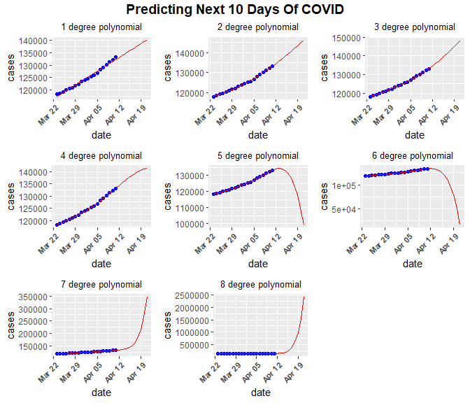<!-- -->

Some of the higher order polynomial fits seem to be making absurdly
unbelievable future predictions. However, some of the lower-order
polynomial models look reasonable. I’m going to focus on the 3-order
polynomial (which looks alright) and pretend it was the model I thought
was best.

``` r
# Make modelling dataframe.
Covid_Canada_Modelling <- Covid_Canada

# Average cases per day, for all provinces.
Covid_Canada_dates <- Covid_Canada_Modelling %>%
  ddply(c("date"), summarise,
        cases = mean(cases),
        deaths = mean(deaths),
        DailyCases = sum(DailyCases),
        DailyDeaths = sum(DailyDeaths))

# New dataframe that starts the final day of COVID data collection and adds 20 days. Also contains blank columns for other variables.
New_Dates <- data.frame(date =seq(max(Covid_Canada_Modelling$date),max(Covid_Canada_Modelling$date) + 10,by='days'),
                        cases = NA,
                        deaths = NA,
                        DailyCases = NA,
                        DailyDeaths = NA)

# Delete first row.
New_Dates = New_Dates[-1,]

# Add future dates to end of modelling dataframe.
Covid_Canada_dates <- rbind(Covid_Canada_dates, New_Dates)

model.2 <- lm(data = tail(Covid_Canada_dates, n = 30), cases ~ poly(date, 3))

# Model summary.
tidy(model.2, conf.int = T)
```

    ## # A tibble: 4 x 7
    ##   term           estimate std.error statistic  p.value conf.low conf.high
    ##   <chr>             <dbl>     <dbl>     <dbl>    <dbl>    <dbl>     <dbl>
    ## 1 (Intercept)    131885.       289.   456.    2.41e-34  131272.   132499.
    ## 2 poly(date, 3)1  49050.      2140.    22.9   1.16e-13   44513.    53587.
    ## 3 poly(date, 3)2   6579.      1633.     4.03  9.70e- 4    3118.    10040.
    ## 4 poly(date, 3)3    -78.5      781.    -0.100 9.21e- 1   -1735.     1578.

``` r
# Predict COVID-19 infections with my model.
Covid_Canada_dates$New <-  predict(object = model.1, newdata = Covid_Canada_dates)
```

I could then apply these coefficients to each new date and get a new
COVID-19 infection total for that day in the future.

``` r
# Look at predictions for future dates.
data.frame("Date" = tail(Covid_Canada_dates$date, n = 15),
           "Actual Cases" = tail(Covid_Canada_dates$cases, n = 15),
           "Predicted Cases" = tail(Covid_Canada_dates$New, n = 15))
```

    ##          Date Actual.Cases Predicted.Cases
    ## 1  0021-04-09     131262.5        131129.6
    ## 2  0021-04-10     132198.0        132155.5
    ## 3  0021-04-11     133161.5        133208.6
    ## 4  0021-04-12     134500.4        134288.2
    ## 5  0021-04-13     135426.8        135393.2
    ## 6  0021-04-14           NA        136522.8
    ## 7  0021-04-15           NA        137675.6
    ## 8  0021-04-16           NA        138850.1
    ## 9  0021-04-17           NA        140044.9
    ## 10 0021-04-18           NA        141258.1
    ## 11 0021-04-19           NA        142487.6
    ## 12 0021-04-20           NA        143731.1
    ## 13 0021-04-21           NA        144986.3
    ## 14 0021-04-22           NA        146250.3
    ## 15 0021-04-23           NA        147520.2

The predicted data matches the actual cases pretty closely for days that
have case data. Thus, the future predictions might now be a little bit
more accurate.

<br/>

It should be stressed, however, that this model still probably isn’t
very good. A more accurate model would need many more predictors, and I
would probably assess overfitting using a process like cross-validation
to compute model variance out of sample. But for this assignment, I will
leave this as it is.

<br/>

# Functions

The dataset I used contains data from every country in the world, not
just Canada. If I wanted to repeat the graphs and analyses I did, I
would have to painstakingly replace each code chunk with the new country
and re-run everything. I decided to make some functions that not only
repeat the analyses I did for Canada, but allow the user to simply add
the country they want to the function, and instantly get up to date
COVID graphs and numbers for that country.

<br/>

## Country List

For users of these functions, it will be useful to get a list of names
of countries that can be used. This function takes no arguments, and
simply outputs a list of all countries the user could choose from.

``` r
Country_List <- function(){
  
  #'@title Country_List: finding countries for COVID-19 plotting in R.
  #'
  #'@author Stephen Pierzchajlo
  #'
  #'@description Function that returns a list of countries
  #' 
  #'@usage Country_List()
  #'
  #'@details This function contains no arguments. The user simply types the function as 
  #'outlined above under Usage, and recieves a list of all countries in the world that can 
  #'be used with other subsequent functions.
  
  # Make package list.
  packages <- c('tidyverse')    
  
  # Install packages not yet installed
  installed_packages <- packages %in% rownames(installed.packages())
  
  if (any(installed_packages == FALSE)) {
    
    install.packages(packages[!installed_packages], repos = c(CRAN = "https://cran.rstudio.com"))
    
    }
  
  # Packages loading
  invisible(lapply(packages, library, character.only = TRUE))

  
  # Total Global Cases Data
  x <-read_csv(url("https://raw.githubusercontent.com/CSSEGISandData/COVID-19/master/csse_covid_19_data/csse_covid_19_time_series/time_series_covid19_confirmed_global.csv"))
  
  # Total global cases data in long format.
  COVID_Global_Long_Date <- gather(x, date, cases, 5:ncol(x), factor_key=TRUE)
  
  # compute all unique countries and return a list.
  return(unique(COVID_Global_Long_Date$`Country/Region`))
  
}
```

## Total cases/deaths in total country

This function outputs the number of cases and deaths up until the
current date in the country chosen by the user. It is only a text
output, and probably is not that important since the next function will
output a graph, but I thought it was nice to include in case someone
wants to view it.

``` r
COVID_Country_Data <- function(country){
  
  #'@title COVID_Country_Data: raw COVID-19 cases and deaths.
  #'
  #'@author Stephen Pierzchajlo
  #'
  #'@description Function that returns raw COVID-19 cases and deaths for a specific country.
  #' 
  #'@usage COVID_Country_Data(country)
  #'
  #'@param country character. Name of country
  #'
  #'@details This function is used to get a numerical output of cases and deaths for a specific 
  #'country. Use Country_List() for a list of country names that can be passed to this function.
  
  # Make package list.
  packages <- c('tidyverse', 'plyr')    
  
  # Install packages not yet installed
  installed_packages <- packages %in% rownames(installed.packages())
  
  if (any(installed_packages == FALSE)) {
    
    install.packages(packages[!installed_packages], repos = c(CRAN = "https://cran.rstudio.com"))
    
  }
  
  # Packages loading
  invisible(lapply(packages, library, character.only = TRUE))
  
  # Adds quotes to country argument which is needed for the subset function.
  country <- rlang::quo_name(rlang::enquo(country))
  
  # Total Global Cases Data
  COVID_Global_Wide<-read_csv(url("https://raw.githubusercontent.com/CSSEGISandData/COVID-19/master/csse_covid_19_data/csse_covid_19_time_series/time_series_covid19_confirmed_global.csv"))
  
  # Total Global Deaths Data
  COVID_Global_Deaths_Wide <-read_csv(url("https://raw.githubusercontent.com/CSSEGISandData/COVID-19/master/csse_covid_19_data/csse_covid_19_time_series/time_series_covid19_deaths_global.csv"))
  
  # Total global cases data in long format.
  COVID_Global_Long_Date <- gather(COVID_Global_Wide, date, cases, 5:ncol(COVID_Global_Wide), factor_key=TRUE)
  
  # Total global deaths data in long format
  COVID_Global_Deaths_Long_Date <- gather(COVID_Global_Deaths_Wide, date, cases, 5:ncol(COVID_Global_Deaths_Wide), factor_key=TRUE)
  
  # Combine death count to cases dataframe.
  COVID_Global_Long_Date$deaths <- COVID_Global_Deaths_Long_Date$cases
  
  # Subset Canadian provinces from total cumulative global cases data.
  Covid <- subset(COVID_Global_Long_Date, `Country/Region` == country)
  
  ### Some countries have provinces, others don't. The strategy I am using to make the dataframes for entire country
  ### won't work in both instances. So we need to apply averaging differently.
  
  # If Province/State is empty:
  if(is.na(Covid$`Province/State`) == TRUE){
    
    # Calculate cases per day by subtracting current count in each row by total cases up until that point.
    Covid$DailyCases <- ave(Covid$cases,Covid$`Country/Region`,  FUN=function(x) c(0, diff(x)))
    
    # Calculate deaths per day by subtracting current count in each row by total deaths up until that point.
    Covid$DailyDeaths <- ave(Covid$deaths,Covid$`Country/Region`,  FUN=function(x) c(0, diff(x)))
    
  }
  
  # If Province/State has values:
  else{
    
    # Calculate cases per day by subtracting current count in each row by total cases up until that point.
    Covid$DailyCases <- ave(Covid$cases,Covid$`Province/State`,  FUN=function(x) c(0, diff(x)))
    
    # Calculate deaths per day by subtracting current count in each row by total deaths up until that point.
    Covid$DailyDeaths <- ave(Covid$deaths,Covid$`Province/State`,  FUN=function(x) c(0, diff(x)))
    
  }
  
  # Make total cases/deaths chart.
  Chart <- Covid %>%
    ddply(c("`Country/Region`"), summarise,
          cases = sum(DailyCases),
          deaths = sum(DailyDeaths)) %>%
    gather(Category, Number, cases:deaths)
  
  # Return chart.
  return(Chart)
  
}
```

## COVID Country Graph Function

``` r
COVID_Country_Graph <- function(country){
  
  #'@title COVID_Country_Graph: Plot total COVID-19 cases and deaths.
  #'
  #'@author Stephen Pierzchajlo
  #'
  #'@description Function that plots the total COVID-19 cases and deaths in a specific country.
  #' 
  #'@usage COVID_Country_Graph(country)
  #'
  #'@param country character. Name of country
  #'
  #'@details This function returns a single graph containing total COVID-19 cases 
  #'and deaths per day. Use Country_List() for a list of country names that can 
  #'be passed to this function.
  
  # Make package list.
  packages <- c('tidyverse', 'plyr', 'ggthemr')    
  
  # Install packages not yet installed
  installed_packages <- packages %in% rownames(installed.packages())
  
  if (any(installed_packages == FALSE)) {
    
    install.packages(packages[!installed_packages], repos = c(CRAN = "https://cran.rstudio.com"))
    
  }
  
  # Packages loading
  invisible(lapply(packages, library, character.only = TRUE))
  
  # Adds quotes to country argument which is needed for the subset function.
  country <- rlang::quo_name(rlang::enquo(country))
  
  # Total Global Cases Data
  COVID_Global_Wide<-read_csv(url("https://raw.githubusercontent.com/CSSEGISandData/COVID-19/master/csse_covid_19_data/csse_covid_19_time_series/time_series_covid19_confirmed_global.csv"))
  
  # Total Global Deaths Data
  COVID_Global_Deaths_Wide <-read_csv(url("https://raw.githubusercontent.com/CSSEGISandData/COVID-19/master/csse_covid_19_data/csse_covid_19_time_series/time_series_covid19_deaths_global.csv"))
  
  # Total global cases data in long format.
  COVID_Global_Long_Date <- gather(COVID_Global_Wide, date, cases, 5:ncol(COVID_Global_Wide), factor_key=TRUE)
  
  # Total global deaths data in long format
  COVID_Global_Deaths_Long_Date <- gather(COVID_Global_Deaths_Wide, date, cases, 5:ncol(COVID_Global_Deaths_Wide), factor_key=TRUE)
  
  # Combine death count to cases dataframe.
  COVID_Global_Long_Date$deaths <- COVID_Global_Deaths_Long_Date$cases
  
  # Subset Canadian provinces from total cumulative global cases data.
  Covid <- subset(COVID_Global_Long_Date, `Country/Region` == country)
  
  ### Some countries have provinces, others don't. The strategy I am using to make the dataframes for entire country
  ### won't work in both instances. So we need to apply averaging differently.
  
  # If Province/State is empty:
  if(is.na(Covid$`Province/State`) == TRUE){
    
    # Calculate cases per day by subtracting current count in each row by total cases up until that point.
    Covid$DailyCases <- ave(Covid$cases,Covid$`Country/Region`,  FUN=function(x) c(0, diff(x)))
    
    # Calculate deaths per day by subtracting current count in each row by total deaths up until that point.
    Covid$DailyDeaths <- ave(Covid$deaths,Covid$`Country/Region`,  FUN=function(x) c(0, diff(x)))
    
  }
  
  # If Province/State has values:
  else{
    
    # Calculate cases per day by subtracting current count in each row by total cases up until that point.
    Covid$DailyCases <- ave(Covid$cases,Covid$`Province/State`,  FUN=function(x) c(0, diff(x)))
    
    # Calculate deaths per day by subtracting current count in each row by total deaths up until that point.
    Covid$DailyDeaths <- ave(Covid$deaths,Covid$`Province/State`,  FUN=function(x) c(0, diff(x)))
    
  }
  
  # Set Theme.
  ggthemr("flat")
  
  # average data in dataframe for graphing.
  a <- Covid %>%
    ddply(c("`Country/Region`"), summarise,
          cases = sum(DailyCases),
          deaths = sum(DailyDeaths)) %>%
    gather(Category, Number, cases:deaths) %>%
    
    # Graph total cases and deaths per province, tilt sideways, stack cases/deaths, display cases count on x-axis/death count above each bar.
    ggplot(aes(x = `Country/Region`, y = Number, fill = factor(Category, levels = c("deaths", "cases")))) +
    geom_bar(stat = "identity", position = "dodge") + 
    scale_colour_ggthemr_d() +
    scale_y_continuous(labels = function(x) format(x, scientific = FALSE))  +
    labs(x = "Country",
         y = "COVID-19 Cases And Deaths",
         title = paste0("Total COVID-19 Cases In ", country),
         caption = paste0("Data source: Government of ", country),
         fill = "Case Type") +
    theme(plot.title = element_text(hjust = 0.5)) +
    geom_text(aes(label = Number), position = position_dodge(width=0.9), vjust = -.2)
  
  return(a)
  
}
```

## COVID Country Cumulative Graph Function

``` r
COVID_Country_Cumulative_Graph <- function(country){
  
  #'@title COVID_Country_Cumulative_Graph: cumulative COVID-19 cases and deaths.
  #'
  #'@author Stephen Pierzchajlo
  #'
  #'@description Function that plots cumulative COVID-19 cases and deaths in a specific country.
  #' 
  #'@usage COVID_Country_Cumulative_Graph(country)
  #'
  #'@param country character. Name of country
  #'
  #'@details This function returns 2 graphs, each containing either cumulative COVID-19 cases 
  #'or cumulative COVID-19 deaths. Use Country_List() for a list of country names that can 
  #'be passed to this function.
  
  # Make package list.
  packages <- c('tidyverse', 'plyr', 'ggthemr')    
  
  # Install packages not yet installed
  installed_packages <- packages %in% rownames(installed.packages())
  
  if (any(installed_packages == FALSE)) {
    
    install.packages(packages[!installed_packages], repos = c(CRAN = "https://cran.rstudio.com"))
    
  }
  
  # Packages loading
  invisible(lapply(packages, library, character.only = TRUE))
  
  # Adds quotes to country argument which is needed for the subset function.
  country <- rlang::quo_name(rlang::enquo(country))
  
  # Total Global Cases Data
  COVID_Global_Wide<-read_csv(url("https://raw.githubusercontent.com/CSSEGISandData/COVID-19/master/csse_covid_19_data/csse_covid_19_time_series/time_series_covid19_confirmed_global.csv"))
  
  # Total Global Deaths Data
  COVID_Global_Deaths_Wide <-read_csv(url("https://raw.githubusercontent.com/CSSEGISandData/COVID-19/master/csse_covid_19_data/csse_covid_19_time_series/time_series_covid19_deaths_global.csv"))
  
  # Total global cases data in long format.
  COVID_Global_Long_Date <- gather(COVID_Global_Wide, date, cases, 5:ncol(COVID_Global_Wide), factor_key=TRUE)
  
  # Total global deaths data in long format
  COVID_Global_Deaths_Long_Date <- gather(COVID_Global_Deaths_Wide, date, cases, 5:ncol(COVID_Global_Deaths_Wide), factor_key=TRUE)
  
  # Combine death count to cases dataframe.
  COVID_Global_Long_Date$deaths <- COVID_Global_Deaths_Long_Date$cases
  
  # Filter canadian provincial data to only include data starting from March 1st.
  Covid <- COVID_Global_Long_Date[352:nrow(COVID_Global_Long_Date), ]
  
  # Subset Canadian provinces from total cumulative global cases data.
  Covid <- subset(COVID_Global_Long_Date, `Country/Region` == country)
  
  # Convert date column to date format for cases dataframe.
  Covid$date <- as.Date(Covid$date, format = "%m/%d/%Y")
  
  # Calculate cases per day by subtracting current count in each row by total cases up until that point.
  Covid$DailyCases <- ave(Covid$cases,Covid$`Country/Region`,  FUN=function(x) c(0, diff(x)))
  
  # Calculate deaths per day by subtracting current count in each row by total deaths up until that point.
  Covid$DailyDeaths <- ave(Covid$deaths,Covid$`Country/Region`,  FUN=function(x) c(0, diff(x)))
  
  # Set Theme.
  ggthemr("flat")
  
  # Cumulative Cases Graph.
  cases <- Covid %>% 
    ggplot(aes(x = date, y = cases, color = `Country/Region`, group = `Country/Region`, fill = `Country/Region`)) +
    geom_area() +
    labs(x = paste0(head(format(Covid$date, "%B %d %y"), n = 1)," to Present"),
         y = "Cumulative Cases",
         title = paste0("Cumulative Coronavirus Cases In ", country),
         caption = c(paste0("Data source: Government of ", country), paste0("Today's Date: ", tail(format(Covid$date, "%B %d %y"), n = 1)))) +
    scale_colour_ggthemr_d() +
    scale_x_date(date_breaks = '1 month', date_labels = '%B') +
    theme(axis.text.x = element_text(face = "bold", size = 9, angle = 45, hjust = 1), plot.title = element_text(hjust = 0.5))
  
  deaths <- Covid %>% 
    ggplot(aes(x = date, y = deaths, color = `Country/Region`, group = `Country/Region`, fill = `Country/Region`)) +
    geom_area() +
    labs(x = paste0(head(format(Covid$date, "%B %d %y"), n = 1)," to Present"),
         y = "Cumulative Cases",
         title = paste0("Cumulative Coronavirus Deaths In ", country),
         caption = c(paste0("Data source: Government of ", country), paste0("Today's Date: ", tail(format(Covid$date, "%B %d %y"), n = 1)))) +
    scale_colour_ggthemr_d() +
    scale_x_date(date_breaks = '1 month', date_labels = '%B') +
    theme(axis.text.x = element_text(face = "bold", size = 9, angle = 45, hjust = 1), plot.title = element_text(hjust = 0.5))
  
  output <- list(cases, deaths)
  
  return(output)
  
}
```

## COVID Country Daily Graph Function

``` r
COVID_Country_Daily_Graph <- function(country){
  
  #'@title COVID_Country_Daily_Graph: plot daily COVID-19 cases and deaths.
  #'
  #'@author Stephen Pierzchajlo
  #'
  #'@description Function that plots daily COVID-19 cases and deaths in a specific country.
  #' 
  #'@usage COVID_Country_Daily_Graph(country)
  #'
  #'@param country character. Name of country
  #'
  #'@details This function returns 2 graphs, each containing either COVID-19 cases per day 
  #'or COVID-19 deaths per day. Use Country_List() for a list of country names that can 
  #'be passed to this function.
  
  # Make package list.
  packages <- c('tidyverse', 'plyr', 'ggthemr')    
  
  # Install packages not yet installed
  installed_packages <- packages %in% rownames(installed.packages())
  
  if (any(installed_packages == FALSE)) {
    
    install.packages(packages[!installed_packages], repos = c(CRAN = "https://cran.rstudio.com"))
    
  }
  
  # Packages loading
  invisible(lapply(packages, library, character.only = TRUE))
  
  # Adds quotes to country argument which is needed for the subset function.
  country <- rlang::quo_name(rlang::enquo(country))
  
  # Total Global Cases Data
  COVID_Global_Wide<-read_csv(url("https://raw.githubusercontent.com/CSSEGISandData/COVID-19/master/csse_covid_19_data/csse_covid_19_time_series/time_series_covid19_confirmed_global.csv"))
  
  # Total Global Deaths Data
  COVID_Global_Deaths_Wide <-read_csv(url("https://raw.githubusercontent.com/CSSEGISandData/COVID-19/master/csse_covid_19_data/csse_covid_19_time_series/time_series_covid19_deaths_global.csv"))
  
  # Total global cases data in long format.
  COVID_Global_Long_Date <- gather(COVID_Global_Wide, date, cases, 5:ncol(COVID_Global_Wide), factor_key=TRUE)
  
  # Total global deaths data in long format
  COVID_Global_Deaths_Long_Date <- gather(COVID_Global_Deaths_Wide, date, cases, 5:ncol(COVID_Global_Deaths_Wide), factor_key=TRUE)
  
  # Combine death count to cases dataframe.
  COVID_Global_Long_Date$deaths <- COVID_Global_Deaths_Long_Date$cases
  
  # Filter canadian provincial data to only include data starting from March 1st.
  Covid <- COVID_Global_Long_Date[352:nrow(COVID_Global_Long_Date), ]
  
  # Subset Canadian provinces from total cumulative global cases data.
  Covid <- subset(COVID_Global_Long_Date, `Country/Region` == country)
  
  # Convert date column to date format for cases dataframe.
  Covid$date <- as.Date(Covid$date, format = "%m/%d/%Y")
  
  ### Some countries have provinces, others don't. The strategy I am using to make the dataframes for entire country
  ### won't work in both instances. So we need to apply averaging differently.
  
  # If Province/State is empty:
  if(is.na(Covid$`Province/State`) == TRUE){
    
    # Calculate cases per day by subtracting current count in each row by total cases up until that point.
    Covid$DailyCases <- ave(Covid$cases,Covid$`Country/Region`,  FUN=function(x) c(0, diff(x)))
    
    # Calculate deaths per day by subtracting current count in each row by total deaths up until that point.
    Covid$DailyDeaths <- ave(Covid$deaths,Covid$`Country/Region`,  FUN=function(x) c(0, diff(x)))
    
    Covid <- Covid %>%
      ddply(c("`date`"), summarise,
            cases = sum(DailyCases),
            deaths = sum(DailyDeaths))
    
  }
  
  # If Province/State has values:
  else{
    
    # Calculate cases per day by subtracting current count in each row by total cases up until that point.
    Covid$DailyCases <- ave(Covid$cases,Covid$`Province/State`,  FUN=function(x) c(0, diff(x)))
    
    # Calculate deaths per day by subtracting current count in each row by total deaths up until that point.
    Covid$DailyDeaths <- ave(Covid$deaths,Covid$`Province/State`,  FUN=function(x) c(0, diff(x)))
    
    Covid <- Covid %>%
      ddply(c("`date`"), summarise,
            cases = sum(DailyCases),
            deaths = sum(DailyDeaths))
    
  }
  
  # Set Theme.
  ggthemr("flat")
  
  # Daily Cases Graph.
  cases <- ggplot(Covid, aes(x = date, y = cases)) +
    geom_bar(stat = "identity") +
    labs(x = paste0(head(format(Covid$date, "%B %d %y"), n = 1)," to Present"),
         y = "Cases Per Day",
         title = paste0("Daily Coronavirus Cases In ", country),
         caption = c(paste0("Data source: Government of ", country), paste0("Today's Date: ", tail(format(Covid$date, "%B %d %y"), n = 1)))) +
    theme(plot.caption = element_text(hjust=c(0, 1))) +
    scale_colour_ggthemr_d() +
    scale_x_date(date_breaks = '1 month', date_labels = '%B') +
    theme(axis.text.x = element_text(face = "bold", size = 8, angle = 45, hjust = 1), plot.title = element_text(hjust = 0.5))
  
  # Daliy Deaths Graph.
  deaths <- ggplot(Covid, aes(x = date, y = deaths)) +
    geom_bar(stat = "identity") +
    labs(x = paste0(head(format(Covid$date, "%B %d %y"), n = 1)," to Present"),
         y = "Deaths Per Day",
         title = paste0("Daily Coronavirus Deaths In ", country),
         caption = c(paste0("Data source: Government of ", country), paste0("Today's Date: ", tail(format(Covid$date, "%B %d %y"), n = 1)))) +
    theme(plot.caption = element_text(hjust=c(0, 1))) +
    scale_colour_ggthemr_d() +
    scale_x_date(date_breaks = '1 month', date_labels = '%B') +
    theme(axis.text.x = element_text(face = "bold", size = 8, angle = 45, hjust = 1), plot.title = element_text(hjust = 0.5))
  
  outputs <- list(cases, deaths)
  
  return(outputs)
  
}
```

# Testing Functions

Here I am going to use each function as if I had not done any of the
previous work in this R project. So, I will first delete everything that
has been done up to this point.

``` r
# This function removes the entire global environment!!!
rm(list = ls())
```

Next, I will load the docstring package manually since it cannot be
loaded from inside a function. The docstring package allows you to add
documentation to a function. If it isn’t installed, install before
running the next line.

``` r
# Create documentation for functions.
# Make package list.
packages <- c('docstring')    
  
# Install packages not yet installed
installed_packages <- packages %in% rownames(installed.packages())

if (any(installed_packages == FALSE)) {
  
  install.packages(packages[!installed_packages], repos = c(CRAN = "https://cran.rstudio.com"))
  
  }

# Packages loading
invisible(lapply(packages, library, character.only = TRUE))
  
library(docstring)
```

## Source Functions

I made 5 functions, so I will link to their directories so they can be
automatically called.

``` r
# Source Country_List()
source("C:\\Users\\STPI0560\\Desktop\\R Projects\\COVID-19---Canada\\bin\\Country_List.R", local = knitr::knit_global())

# Source COVID_Country_Data()
source("C:\\Users\\STPI0560\\Desktop\\R Projects\\COVID-19---Canada\\bin\\COVID_Country_Data.R", local = knitr::knit_global())

# Source COVID_Country_Graph()
source("C:\\Users\\STPI0560\\Desktop\\R Projects\\COVID-19---Canada\\bin\\COVID_Country_Graph.R", local = knitr::knit_global())

# Source COVID_Cumulative_Graph()
source("C:\\Users\\STPI0560\\Desktop\\R Projects\\COVID-19---Canada\\bin\\COVID_Country_Cumulative_Graph.R", local = knitr::knit_global())

# Source COVID_Country_Daily_Graph()
source("C:\\Users\\STPI0560\\Desktop\\R Projects\\COVID-19---Canada\\bin\\COVID_Country_Daily_Graph.R", local = knitr::knit_global())
```

## Trying Functions Out

Here I will try the functions out with a few countries other than canada
to see what the output looks like. First, I will look a the list of
countries and pick a few.

``` r
Country_List()
```

    ##   [1] "Afghanistan"                      "Albania"                         
    ##   [3] "Algeria"                          "Andorra"                         
    ##   [5] "Angola"                           "Antigua and Barbuda"             
    ##   [7] "Argentina"                        "Armenia"                         
    ##   [9] "Australia"                        "Austria"                         
    ##  [11] "Azerbaijan"                       "Bahamas"                         
    ##  [13] "Bahrain"                          "Bangladesh"                      
    ##  [15] "Barbados"                         "Belarus"                         
    ##  [17] "Belgium"                          "Belize"                          
    ##  [19] "Benin"                            "Bhutan"                          
    ##  [21] "Bolivia"                          "Bosnia and Herzegovina"          
    ##  [23] "Botswana"                         "Brazil"                          
    ##  [25] "Brunei"                           "Bulgaria"                        
    ##  [27] "Burkina Faso"                     "Burma"                           
    ##  [29] "Burundi"                          "Cabo Verde"                      
    ##  [31] "Cambodia"                         "Cameroon"                        
    ##  [33] "Canada"                           "Central African Republic"        
    ##  [35] "Chad"                             "Chile"                           
    ##  [37] "China"                            "Colombia"                        
    ##  [39] "Comoros"                          "Congo (Brazzaville)"             
    ##  [41] "Congo (Kinshasa)"                 "Costa Rica"                      
    ##  [43] "Cote d'Ivoire"                    "Croatia"                         
    ##  [45] "Cuba"                             "Cyprus"                          
    ##  [47] "Czechia"                          "Denmark"                         
    ##  [49] "Diamond Princess"                 "Djibouti"                        
    ##  [51] "Dominica"                         "Dominican Republic"              
    ##  [53] "Ecuador"                          "Egypt"                           
    ##  [55] "El Salvador"                      "Equatorial Guinea"               
    ##  [57] "Eritrea"                          "Estonia"                         
    ##  [59] "Eswatini"                         "Ethiopia"                        
    ##  [61] "Fiji"                             "Finland"                         
    ##  [63] "France"                           "Gabon"                           
    ##  [65] "Gambia"                           "Georgia"                         
    ##  [67] "Germany"                          "Ghana"                           
    ##  [69] "Greece"                           "Grenada"                         
    ##  [71] "Guatemala"                        "Guinea"                          
    ##  [73] "Guinea-Bissau"                    "Guyana"                          
    ##  [75] "Haiti"                            "Holy See"                        
    ##  [77] "Honduras"                         "Hungary"                         
    ##  [79] "Iceland"                          "India"                           
    ##  [81] "Indonesia"                        "Iran"                            
    ##  [83] "Iraq"                             "Ireland"                         
    ##  [85] "Israel"                           "Italy"                           
    ##  [87] "Jamaica"                          "Japan"                           
    ##  [89] "Jordan"                           "Kazakhstan"                      
    ##  [91] "Kenya"                            "Korea, South"                    
    ##  [93] "Kosovo"                           "Kuwait"                          
    ##  [95] "Kyrgyzstan"                       "Laos"                            
    ##  [97] "Latvia"                           "Lebanon"                         
    ##  [99] "Lesotho"                          "Liberia"                         
    ## [101] "Libya"                            "Liechtenstein"                   
    ## [103] "Lithuania"                        "Luxembourg"                      
    ## [105] "MS Zaandam"                       "Madagascar"                      
    ## [107] "Malawi"                           "Malaysia"                        
    ## [109] "Maldives"                         "Mali"                            
    ## [111] "Malta"                            "Marshall Islands"                
    ## [113] "Mauritania"                       "Mauritius"                       
    ## [115] "Mexico"                           "Micronesia"                      
    ## [117] "Moldova"                          "Monaco"                          
    ## [119] "Mongolia"                         "Montenegro"                      
    ## [121] "Morocco"                          "Mozambique"                      
    ## [123] "Namibia"                          "Nepal"                           
    ## [125] "Netherlands"                      "New Zealand"                     
    ## [127] "Nicaragua"                        "Niger"                           
    ## [129] "Nigeria"                          "North Macedonia"                 
    ## [131] "Norway"                           "Oman"                            
    ## [133] "Pakistan"                         "Panama"                          
    ## [135] "Papua New Guinea"                 "Paraguay"                        
    ## [137] "Peru"                             "Philippines"                     
    ## [139] "Poland"                           "Portugal"                        
    ## [141] "Qatar"                            "Romania"                         
    ## [143] "Russia"                           "Rwanda"                          
    ## [145] "Saint Kitts and Nevis"            "Saint Lucia"                     
    ## [147] "Saint Vincent and the Grenadines" "Samoa"                           
    ## [149] "San Marino"                       "Sao Tome and Principe"           
    ## [151] "Saudi Arabia"                     "Senegal"                         
    ## [153] "Serbia"                           "Seychelles"                      
    ## [155] "Sierra Leone"                     "Singapore"                       
    ## [157] "Slovakia"                         "Slovenia"                        
    ## [159] "Solomon Islands"                  "Somalia"                         
    ## [161] "South Africa"                     "South Sudan"                     
    ## [163] "Spain"                            "Sri Lanka"                       
    ## [165] "Sudan"                            "Suriname"                        
    ## [167] "Sweden"                           "Switzerland"                     
    ## [169] "Syria"                            "Taiwan*"                         
    ## [171] "Tajikistan"                       "Tanzania"                        
    ## [173] "Thailand"                         "Timor-Leste"                     
    ## [175] "Togo"                             "Trinidad and Tobago"             
    ## [177] "Tunisia"                          "Turkey"                          
    ## [179] "US"                               "Uganda"                          
    ## [181] "Ukraine"                          "United Arab Emirates"            
    ## [183] "United Kingdom"                   "Uruguay"                         
    ## [185] "Uzbekistan"                       "Vanuatu"                         
    ## [187] "Venezuela"                        "Vietnam"                         
    ## [189] "West Bank and Gaza"               "Yemen"                           
    ## [191] "Zambia"                           "Zimbabwe"

From the list above, I will pick a few countries. Israel has seen cases
plummet, so I would like to see their trends. Brazil has seen an
exponential rise in cases, so I would like to see this as well.

``` r
COVID_Country_Data(Israel)
```

    ##   Country/Region Category Number
    ## 1         Israel    cases 836334
    ## 2         Israel   deaths   6309

``` r
COVID_Country_Data(Brazil)
```

    ##   Country/Region Category   Number
    ## 1         Brazil    cases 13599994
    ## 2         Brazil   deaths   358425

``` r
COVID_Country_Graph(Israel)
```

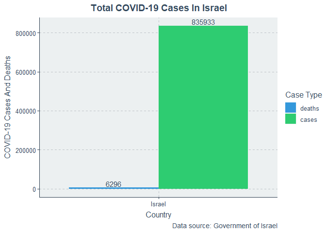<!-- -->

``` r
COVID_Country_Graph(Brazil)
```

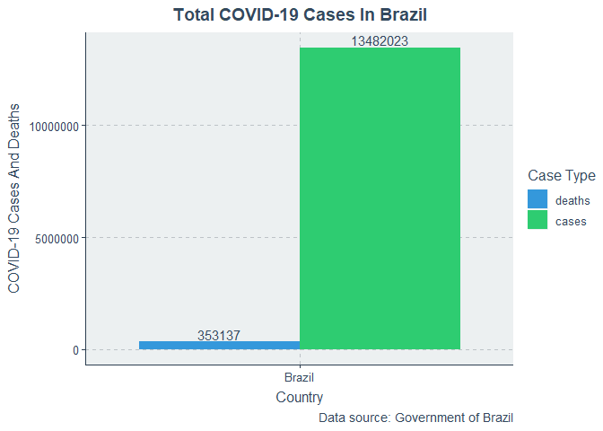<!-- -->

``` r
COVID_Country_Cumulative_Graph(Israel)
```

    ## [[1]]

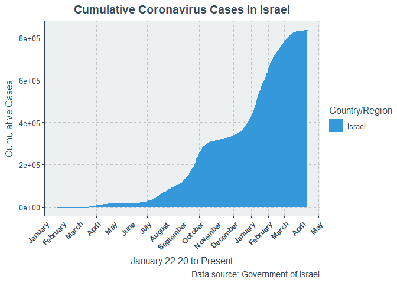<!-- -->

    ## 
    ## [[2]]

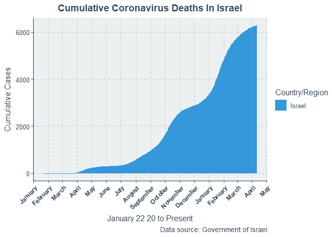<!-- -->

``` r
COVID_Country_Cumulative_Graph(Brazil)
```

    ## [[1]]

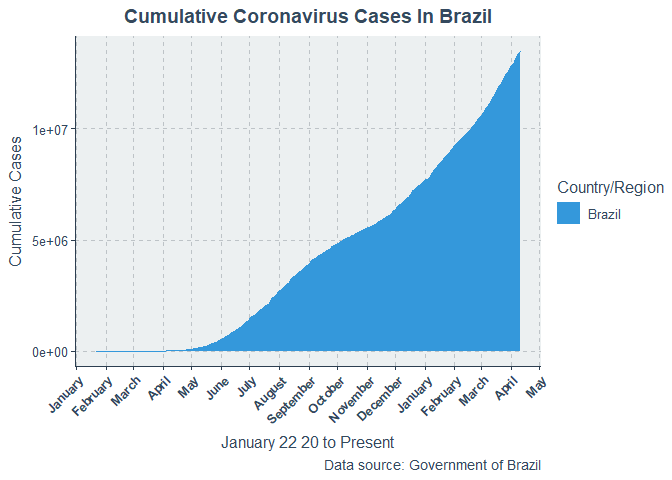<!-- -->

    ## 
    ## [[2]]

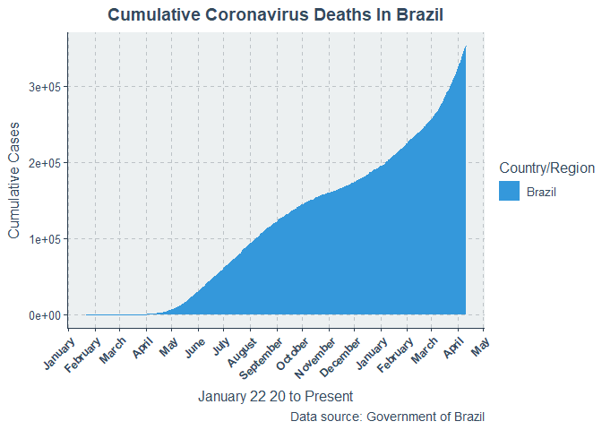<!-- -->

``` r
COVID_Country_Daily_Graph(Israel)
```

    ## [[1]]

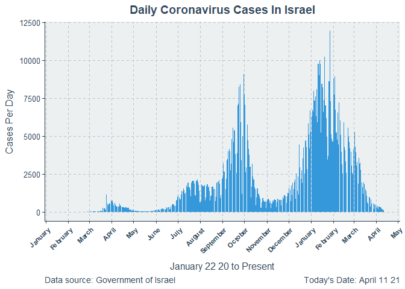<!-- -->

    ## 
    ## [[2]]

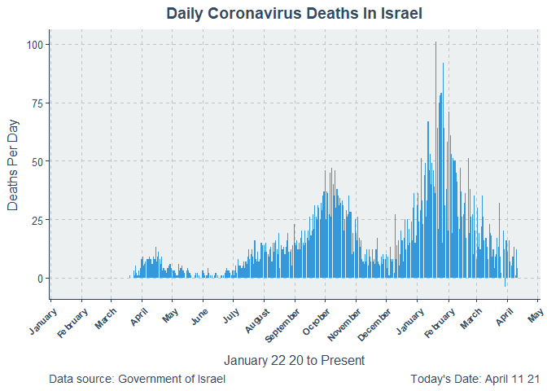<!-- -->

``` r
COVID_Country_Daily_Graph(Brazil)
```

    ## [[1]]

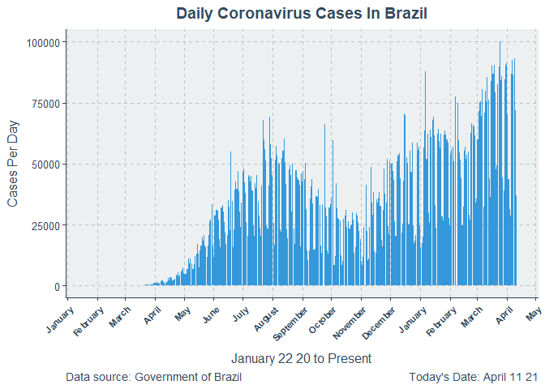<!-- -->

    ## 
    ## [[2]]

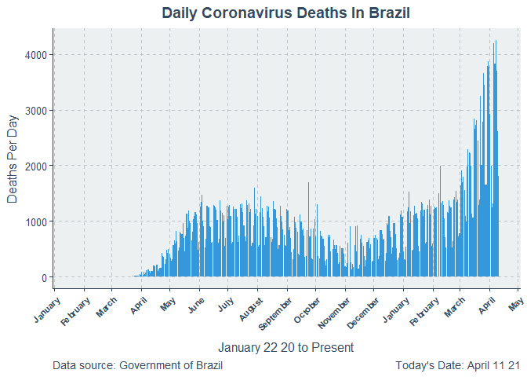<!-- -->

<br/>

In addition to the functions, I have also included simple documentation
with these functions. For instance, the user of these functions could
review the Country\_List() function to see how to use it like this:
?Country\_List(). I can’t display the output in R Markdown, but when
used in R Studio, documentation for each function appears in the right
paned Helper.

# Future Work

I am hoping to add moreflexibility to these functions. First, I want to
add a time machine option. COVID-19 will eventually be over, so the data
will eventually have nothing. Therefore, I want to add an argument that
lets you pick a date, and then the function will pretend we are on that
date. I also want to let people compare different countries on the same
graph, sort of like I did with the province comparision graphs. However,
this would require a per capita transformation of cases to account for
large population differences. This would be a big undertaking, and not
one I want to do for this assignment. But that is it.
