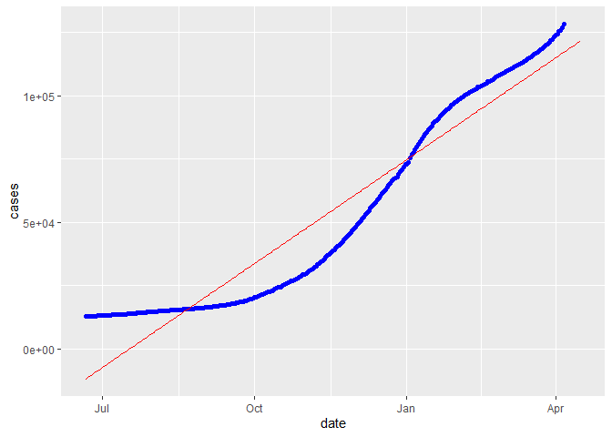
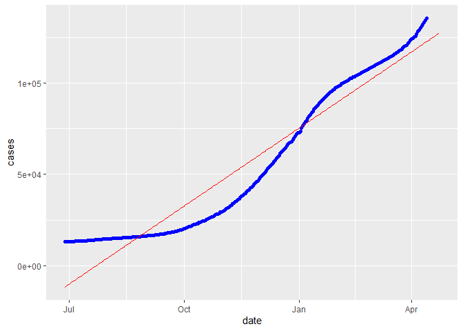

COVID-19 Canadian data: pre-processing, visualizations, and modelling
================
Stephen Pierzchajlo

# Introduction

Many months ago I helped analyse data for a paper on COVID-19. The paper
is currently under review, but all analyses, data, and scripts can be
found here: <https://osf.io/c8zhn/>

<br/>

My contribution included getting COVID-19 data for 4 specific weeks to
use as 1 predictor in a model for the main analysis of the paper.
Because I have a COVID-19 data repository at hand, I wanted to put
together a project where I look at Canadian COVID-19 data.

<br/>

Here I’ll demonstrate how to automatically download COVID-19 worldwide
data, clean the dataframe, display simple figures, and do some simple
predictive modelling. Importantly, the data I’ll be using is massive and
not yet ready for visualisation in its raw format, so I need to perform
some wrangling first.

## Load Libraries

``` r
# Load libraries
library(tidyverse)
library(gghighlight)
library(plyr)
library(ggthemr)
library(ggpubr)
library(MASS)
library(caret)
```

<br/>

## Finding a COVID-19 Repository

Their are different COVID-19 data repositories, and I am using two files
that contains COVID-19 data for every country in the world. File 1
contains data about total worldwide cases and file 2 contains data about
total worldwide deaths. Each time the code chunk below is run, it grabs
each *.csv* file from a github repository that has been updated within
the past 24 hours. This is ideal, because it means that anytime I run
this script, I have COVID-19 statistics that are as recent as yesterday.
I prefer this approach to downloading a static *.csv* file because
COVID-19 cases and deaths are ongoing and constantly changing.

``` r
# Here, we load .csv files from github. These are updated daily, so everytime this analysis is run, it uses the most up to date information.

# Total Global Cases Data
COVID_Global_Wide<-read_csv(url("https://raw.githubusercontent.com/CSSEGISandData/COVID-19/master/csse_covid_19_data/csse_covid_19_time_series/time_series_covid19_confirmed_global.csv"))

# Total Global Deaths Data
COVID_Global_Deaths_Wide <-read_csv(url("https://raw.githubusercontent.com/CSSEGISandData/COVID-19/master/csse_covid_19_data/csse_covid_19_time_series/time_series_covid19_deaths_global.csv"))
```

<br/>

## Quick Look at Raw Data

First I’ll look at the overall shape of one of these dataframes.

``` r
# Print number of rows and columns.
cat(" There are", nrow(COVID_Global_Wide), "rows in this dataframe.\n","There are", ncol(COVID_Global_Wide), "columns in this dataframe.")
```

    ##  There are 274 rows in this dataframe.
    ##  There are 444 columns in this dataframe.

There are a massive number of columns. Why is that? I decided to take a
look at the overall structure.

``` r
# Display first 10 rows and all columns.
COVID_Global_Wide[1:10, ]
```

    ## # A tibble: 10 x 444
    ##    `Province/State`  `Country/Region`   Lat   Long `1/22/20` `1/23/20` `1/24/20`
    ##    <chr>             <chr>            <dbl>  <dbl>     <dbl>     <dbl>     <dbl>
    ##  1 <NA>              Afghanistan       33.9  67.7          0         0         0
    ##  2 <NA>              Albania           41.2  20.2          0         0         0
    ##  3 <NA>              Algeria           28.0   1.66         0         0         0
    ##  4 <NA>              Andorra           42.5   1.52         0         0         0
    ##  5 <NA>              Angola           -11.2  17.9          0         0         0
    ##  6 <NA>              Antigua and Bar~  17.1 -61.8          0         0         0
    ##  7 <NA>              Argentina        -38.4 -63.6          0         0         0
    ##  8 <NA>              Armenia           40.1  45.0          0         0         0
    ##  9 Australian Capit~ Australia        -35.5 149.           0         0         0
    ## 10 New South Wales   Australia        -33.9 151.           0         0         0
    ## # ... with 437 more variables: 1/25/20 <dbl>, 1/26/20 <dbl>, 1/27/20 <dbl>,
    ## #   1/28/20 <dbl>, 1/29/20 <dbl>, 1/30/20 <dbl>, 1/31/20 <dbl>, 2/1/20 <dbl>,
    ## #   2/2/20 <dbl>, 2/3/20 <dbl>, 2/4/20 <dbl>, 2/5/20 <dbl>, 2/6/20 <dbl>,
    ## #   2/7/20 <dbl>, 2/8/20 <dbl>, 2/9/20 <dbl>, 2/10/20 <dbl>, 2/11/20 <dbl>,
    ## #   2/12/20 <dbl>, 2/13/20 <dbl>, 2/14/20 <dbl>, 2/15/20 <dbl>, 2/16/20 <dbl>,
    ## #   2/17/20 <dbl>, 2/18/20 <dbl>, 2/19/20 <dbl>, 2/20/20 <dbl>, 2/21/20 <dbl>,
    ## #   2/22/20 <dbl>, 2/23/20 <dbl>, 2/24/20 <dbl>, 2/25/20 <dbl>, 2/26/20 <dbl>,
    ## #   2/27/20 <dbl>, 2/28/20 <dbl>, 2/29/20 <dbl>, 3/1/20 <dbl>, 3/2/20 <dbl>,
    ## #   3/3/20 <dbl>, 3/4/20 <dbl>, 3/5/20 <dbl>, 3/6/20 <dbl>, 3/7/20 <dbl>,
    ## #   3/8/20 <dbl>, 3/9/20 <dbl>, 3/10/20 <dbl>, 3/11/20 <dbl>, 3/12/20 <dbl>,
    ## #   3/13/20 <dbl>, 3/14/20 <dbl>, 3/15/20 <dbl>, 3/16/20 <dbl>, 3/17/20 <dbl>,
    ## #   3/18/20 <dbl>, 3/19/20 <dbl>, 3/20/20 <dbl>, 3/21/20 <dbl>, 3/22/20 <dbl>,
    ## #   3/23/20 <dbl>, 3/24/20 <dbl>, 3/25/20 <dbl>, 3/26/20 <dbl>, 3/27/20 <dbl>,
    ## #   3/28/20 <dbl>, 3/29/20 <dbl>, 3/30/20 <dbl>, 3/31/20 <dbl>, 4/1/20 <dbl>,
    ## #   4/2/20 <dbl>, 4/3/20 <dbl>, 4/4/20 <dbl>, 4/5/20 <dbl>, 4/6/20 <dbl>,
    ## #   4/7/20 <dbl>, 4/8/20 <dbl>, 4/9/20 <dbl>, 4/10/20 <dbl>, 4/11/20 <dbl>,
    ## #   4/12/20 <dbl>, 4/13/20 <dbl>, 4/14/20 <dbl>, 4/15/20 <dbl>, 4/16/20 <dbl>,
    ## #   4/17/20 <dbl>, 4/18/20 <dbl>, 4/19/20 <dbl>, 4/20/20 <dbl>, 4/21/20 <dbl>,
    ## #   4/22/20 <dbl>, 4/23/20 <dbl>, 4/24/20 <dbl>, 4/25/20 <dbl>, 4/26/20 <dbl>,
    ## #   4/27/20 <dbl>, 4/28/20 <dbl>, 4/29/20 <dbl>, 4/30/20 <dbl>, 5/1/20 <dbl>,
    ## #   5/2/20 <dbl>, 5/3/20 <dbl>, ...

As seen above, the *.csv* file has been arranged such that each column
is a date (ignoring the first 4 columns), with values in a column
corresponding to the total cases/deaths up until that date. This format
is not easy to work with, and it means a new column will appear every
day. After 1 week this dataframe will have 7 more columns.

<br/>

## Reshaping Dataframes

To make the data easier to work with, I will create one column called
“date” where each row is a date. In a column beside it, I will have
the total cases/deaths for that date. Now instead of 100s of columns
that contain dates, we only have one column.

``` r
# Total global cases data in long format.
COVID_Global_Long_Date <- gather(COVID_Global_Wide, date, cases, 5:ncol(COVID_Global_Wide), factor_key=TRUE)

# Total global deaths data in long format
COVID_Global_Deaths_Long_Date <- gather(COVID_Global_Deaths_Wide, date, cases, 5:ncol(COVID_Global_Deaths_Wide), factor_key=TRUE)

# Take a look at several of the first rows.
head(COVID_Global_Long_Date)
```

    ## # A tibble: 6 x 6
    ##   `Province/State` `Country/Region`      Lat   Long date    cases
    ##   <chr>            <chr>               <dbl>  <dbl> <fct>   <dbl>
    ## 1 <NA>             Afghanistan          33.9  67.7  1/22/20     0
    ## 2 <NA>             Albania              41.2  20.2  1/22/20     0
    ## 3 <NA>             Algeria              28.0   1.66 1/22/20     0
    ## 4 <NA>             Andorra              42.5   1.52 1/22/20     0
    ## 5 <NA>             Angola              -11.2  17.9  1/22/20     0
    ## 6 <NA>             Antigua and Barbuda  17.1 -61.8  1/22/20     0

<br/>

## Combining Dataframes

Since both dataframes come from the same source, they might have the
same structure. If so, we could just attach the deaths column from the
second dataframe to the first dataframe. Below we loop through both
dataframe, and for each column check how many rows have matching
information in the same position, and how many have non-matching
information. We do this for all pairs of columns except for the
cases/deaths (since those should be different). If there are any
differences, we should get some false statments below. If there are no
differences, we should have a single count that says “true”.

``` r
# Check whether the cases and deaths dataframes have exactly the same information per row (except actual cases/deaths).
for(i in length(colnames(COVID_Global_Long_Date)) - 2){
  
  print(table(COVID_Global_Long_Date[[i]] == COVID_Global_Deaths_Long_Date[[i]]))
  
}
```

    ## 
    ##   TRUE 
    ## 120120

Everything matches, so I’m going to add the cases column from the deaths
dataframe to the cases dataframe. Additionally, I’ll call this new
column “deaths”:

``` r
# Combine death count to cases dataframe.
COVID_Global_Long_Date$deaths <- COVID_Global_Deaths_Long_Date$cases
```

Now, I can quickly check the dataframe to see how it looks.

``` r
# See first few rows.
head(COVID_Global_Long_Date)
```

    ## # A tibble: 6 x 7
    ##   `Province/State` `Country/Region`      Lat   Long date    cases deaths
    ##   <chr>            <chr>               <dbl>  <dbl> <fct>   <dbl>  <dbl>
    ## 1 <NA>             Afghanistan          33.9  67.7  1/22/20     0      0
    ## 2 <NA>             Albania              41.2  20.2  1/22/20     0      0
    ## 3 <NA>             Algeria              28.0   1.66 1/22/20     0      0
    ## 4 <NA>             Andorra              42.5   1.52 1/22/20     0      0
    ## 5 <NA>             Angola              -11.2  17.9  1/22/20     0      0
    ## 6 <NA>             Antigua and Barbuda  17.1 -61.8  1/22/20     0      0

<br/>

## Filtering Provinces

Because I only want data from Canada, I need to filter out every other
country.

``` r
# Subset Canadian provinces from total cumulative global cases data.
Covid_Canada <- subset(COVID_Global_Long_Date, `Country/Region` == "Canada")
```

I can then check how many provinces I have in the filtered dataframe.

``` r
# See how many provinces are in the dataset.
unique(Covid_Canada$`Province/State`)
```

    ##  [1] "Alberta"                   "British Columbia"         
    ##  [3] "Diamond Princess"          "Grand Princess"           
    ##  [5] "Manitoba"                  "New Brunswick"            
    ##  [7] "Newfoundland and Labrador" "Northwest Territories"    
    ##  [9] "Nova Scotia"               "Nunavut"                  
    ## [11] "Ontario"                   "Prince Edward Island"     
    ## [13] "Quebec"                    "Repatriated Travellers"   
    ## [15] "Saskatchewan"              "Yukon"

<br/>

Now, their are only 16 provinces, covering every Canadian province.
However, I only want to focus on the most populated provinces (many
territories have extremely small populations). Therefore, I will focus
on the 8 largest provinces, which will be subsetted below.

``` r
# List of Provinces.
Province_List <- c("Ontario", "Quebec", "New Brunswick", "Manitoba", "British Columbia", "Saskatchewan", "Alberta", "Newfoundland and Labrador")

# For province data, I'm not immediately interested in Canadian Territories, so I'll filter those out.
Covid_Canada <- Covid_Canada %>%
  filter(`Province/State` %in% Province_List)
```

Now I can double-check the number of provinces in my further filtered
dataframe.

``` r
# See how many provinces are in the dataset.
unique(Covid_Canada$`Province/State`)
```

    ## [1] "Alberta"                   "British Columbia"         
    ## [3] "Manitoba"                  "New Brunswick"            
    ## [5] "Newfoundland and Labrador" "Ontario"                  
    ## [7] "Quebec"                    "Saskatchewan"

Looks good\!

<br/>

I also want to filter out dates earlier than March 1st 2020.

``` r
# Filter canadian provincial data to only include data starting from March 1st.
Covid_Canada <- Covid_Canada[352:nrow(Covid_Canada), ]

# Check first row of date column,
Covid_Canada[1,5]
```

    ## # A tibble: 1 x 1
    ##   date  
    ##   <fct> 
    ## 1 3/5/20

It appears now that the dataframe starts around the first of march. My
filtering wasn’t exact, but I think it’s good enough.

<br/>

## Converting Date Variable to Date Object.

Looking at the data below…

``` r
# Check data structure.
str(Covid_Canada)
```

    ## tibble [3,169 x 7] (S3: tbl_df/tbl/data.frame)
    ##  $ Province/State: chr [1:3169] "Saskatchewan" "Alberta" "British Columbia" "Manitoba" ...
    ##  $ Country/Region: chr [1:3169] "Canada" "Canada" "Canada" "Canada" ...
    ##  $ Lat           : num [1:3169] 52.9 53.9 53.7 53.8 46.6 ...
    ##  $ Long          : num [1:3169] -106.5 -116.6 -127.6 -98.8 -66.5 ...
    ##  $ date          : Factor w/ 440 levels "1/22/20","1/23/20",..: 44 45 45 45 45 45 45 45 45 46 ...
    ##  $ cases         : num [1:3169] 0 1 21 0 0 0 25 2 0 2 ...
    ##  $ deaths        : num [1:3169] 0 0 0 0 0 0 0 0 0 0 ...

…the date object is a Factor. However, I want it to be a date object
instead. Below I do just that.

``` r
# Convert date column to date format for cases dataframe.
Covid_Canada$date <- as.Date(Covid_Canada$date, format = "%m/%d/%Y")

# Display date variable type.
str(Covid_Canada$date)
```

    ##  Date[1:3169], format: "0020-03-05" "0020-03-06" "0020-03-06" "0020-03-06" "0020-03-06" ...

Now we can see how the dates are formatted as actual dates.

<br/>

I also don’t need the Country/Region, Lat, or Long data, so I’m going to
get rid of it.

``` r
# Take only a subset of columns.
Covid_Canada <- subset(Covid_Canada, select = c("Province/State", "date", "cases", "deaths"))
```

<br/>

The cases and deaths are cumulative, so each row tells us how many total
cases there have been up to that date. If I want cases per day, I need
to add new columns. Below I make two new columns that only have
cases/deaths for that day. To do that I take a value from one row, and
subtract it from the previous row.

``` r
# Calculate cases per day by subtracting current count in each row by total cases up until that point.
Covid_Canada$DailyCases <- ave(Covid_Canada$cases,Covid_Canada$`Province/State`,  FUN=function(x) c(0, diff(x)))

# Calculate deaths per day by subtracting current count in each row by total deaths up until that point.
Covid_Canada$DailyDeaths <- ave(Covid_Canada$deaths,Covid_Canada$`Province/State`,  FUN=function(x) c(0, diff(x)))
```

<br/>

## Per Capita Correction

Because I am comparing provinces, absolute cases/deaths will be
misleading since different provinces have different population sizes. I
am going to add a new column using case\_when, that gives cases/deaths
per 100,000 people. I had to look up the population for each province,
and then I divided cases/deaths in each province by the province’s
population, and multiplied it by 100,000.

``` r
# Calculate total cases in each province per 100,000 people.
Covid_Canada$Cases_Per100000 <- as.numeric(case_when(Covid_Canada$`Province/State` == "Alberta" ~ (Covid_Canada$cases/4345737) * 100000,
                                                     Covid_Canada$`Province/State` == "British Columbia" ~ (Covid_Canada$cases/5020302) * 100000,
                                                     Covid_Canada$`Province/State` == "Manitoba" ~ (Covid_Canada$cases/1360396) * 100000,
                                                     Covid_Canada$`Province/State` == "New Brunswick" ~ (Covid_Canada$cases/772094) * 100000,
                                                     Covid_Canada$`Province/State` == "Newfoundland and Labrador" ~ (Covid_Canada$cases/523790) * 100000,
                                                     Covid_Canada$`Province/State` == "Ontario" ~ (Covid_Canada$cases/14446515) * 100000,
                                                     Covid_Canada$`Province/State` == "Quebec" ~ (Covid_Canada$cases/8433301) * 100000,
                                                     Covid_Canada$`Province/State` == "Saskatchewan" ~ (Covid_Canada$cases/1168423) * 100000))
```

``` r
# Calculate total deaths in each province per 100,000 people.
Covid_Canada$Deaths_Per100000 <- as.numeric(case_when(Covid_Canada$`Province/State` == "Alberta" ~ (Covid_Canada$deaths/4345737) * 100000,
                                                      Covid_Canada$`Province/State` == "British Columbia" ~ (Covid_Canada$deaths/5020302) * 100000, 
                                                      Covid_Canada$`Province/State` == "Manitoba" ~ (Covid_Canada$deaths/1360396) * 100000,
                                                      Covid_Canada$`Province/State` == "New Brunswick" ~ (Covid_Canada$deaths/772094) * 100000,
                                                      Covid_Canada$`Province/State` == "Newfoundland and Labrador" ~ (Covid_Canada$deaths/523790) * 100000,
                                                      Covid_Canada$`Province/State` == "Ontario" ~ (Covid_Canada$deaths/14446515) * 100000,
                                                      Covid_Canada$`Province/State` == "Quebec" ~ (Covid_Canada$deaths/8433301) * 100000,
                                                      Covid_Canada$`Province/State` == "Saskatchewan" ~ (Covid_Canada$deaths/1168423) * 100000))
```

<br/>

# Graphs

## Total cases/deaths in each province.

I want to first see the total cases/deaths in each province. I decided
to make a stacked bar graph where each bar represents total cases in a
province. Each bar is seperated by the proportion of cases to deaths.
The x-axis displays total cases, and I put text beside each bar to
display just the total deaths per province.

``` r
# Set Theme.
ggthemr("flat")

# average data in dataframe for graphing.
a <- Covid_Canada %>%
  ddply(c("`Province/State`"), summarise,
        cases = sum(DailyCases),
        deaths = sum(DailyDeaths)) %>%
  gather(Category, Number, cases:deaths) %>%
  # Graph total cases and deaths per province, tilt sideways, stack cases/deaths, display cases count on x-axis/death count above each bar.
  ggplot(aes(x = reorder(`Province/State`, Number), y = Number, fill = factor(Category, levels = c("deaths", "cases")))) +
  geom_bar(stat = "identity") + 
  scale_colour_ggthemr_d() +
  scale_y_continuous(labels = function(x) format(x, scientific = FALSE))  +
  labs(x = "Province",
       y = "COVID-19 Cases And Deaths",
       title = "Total COVID-19 Cases In Canada",
       caption = "Data source: Government of Canada",
       fill = "Case Type") +
  theme(plot.title = element_text(hjust = 0.5)) +
  geom_text(aes(label = ifelse(Category=="deaths", Number,"")), position = position_stack(vjust=1.1), hjust = -.2, color = "blue") +
  coord_flip()

a
```

<!-- -->

``` r
# Set Theme.
ggthemr("flat")
# Cumulative Cases Graph.
Covid_Canada %>% 
  ggplot(aes(x = date, y = Cases_Per100000, color = `Province/State`, group = `Province/State`, fill = `Province/State`)) +
  geom_area() +
  labs(x = "March 1st (2020) To Present",
       y = "Cumulative Cases Per 100,000 People",
       title = "Coronavirus Cases Per Canadian Province",
       caption = "Data source: Government of Canada") +
  scale_colour_ggthemr_d() +
  scale_x_date(date_breaks = '1 month',
        date_labels = '%B') +
  theme(axis.text.x = element_text(face = "bold", size = 9, angle = 45, hjust = 1),
        plot.title = element_text(hjust = 0.5))
```

<!-- -->

``` r
# Set Theme.
ggthemr("flat")

#Cumulative Deaths Graph.
Covid_Canada %>% 
  ggplot(aes(x = date, y = Deaths_Per100000, color = `Province/State`, group = `Province/State`, fill = `Province/State`)) +
  geom_area() +
  labs(x = "March 1st (2020) To Present",
       y = "Cumulative Deaths Per 100,000 People",
       title = "Coronavirus Deaths Per Canadian Province",
       caption = "Data source: Government of Canada") +
  scale_colour_ggthemr_d() +
  scale_x_date(date_breaks = '1 month', date_labels = '%B') +
  theme(axis.text.x = element_text(face = "bold", size = 9, angle = 45, hjust = 1),
        plot.title = element_text(hjust = 0.5))
```

<!-- -->

``` r
# Set Theme.
ggthemr("flat")

# Daily Cases Graph.
Covid_Canada %>% 
  ggplot(aes(x = date, y = DailyCases, color = `Province/State`, group = `Province/State`, fill = `Province/State`)) +
  geom_bar(stat = "identity") +
  facet_wrap(~`Province/State`, nrow = 2, ncol = 4) +
  labs(y = "Cases Per Day",
       title = "Daily Coronavirus Cases Per Canadian Province",
       caption = "Data source: Government of Canada") +
  scale_colour_ggthemr_d() +
  scale_x_date(name = 'March 1st (2020) To Present', date_breaks = '1 month', date_labels = '%B') +
  theme(axis.text.x = element_text(face = "bold", size = 8, angle = 45, hjust = 1),
        plot.title = element_text(hjust = 0.5)) +
  gghighlight()
```

<!-- -->

``` r
# Set Theme.
ggthemr("flat")

# Daily Deaths Graph.
Covid_Canada %>% 
  ggplot(aes(x = date, y = DailyDeaths, color = `Province/State`, group = `Province/State`, fill = `Province/State`)) +
  geom_bar(stat = "identity") +
  facet_wrap(~`Province/State`, nrow = 2, ncol = 4) +
  labs(y = "Deaths Per Day",
       title = "Daily Coronavirus Deaths Per Canadian Province",
       caption = "Data source: Government of Canada") +
  scale_colour_ggthemr_d() +
  scale_x_date(name = 'March 1st (2020) To Present', date_breaks = '1 month', date_labels = '%B') +
  theme(axis.text.x = element_text(face = "bold", size = 8, angle = 45, hjust = 1),
        plot.title = element_text(hjust = 0.5)) +
  gghighlight()
```

<!-- -->

``` r
# Reset Theme.
ggthemr_reset()
```

# Modelling

Because the assignment calls for some sort of analysis, I decided to try
some predictive modelling using this dataset. While this dataset lends
itself much more to qualitative analysis, I have seen many COVID models
where they try to predict future cases based on current trends. I have
never done anything like that before, but I thought this might be a good
way to learn.

<br/>

First, I Made a new dataframe for predictive modelling, since I will
need to add future dates to it.

``` r
# Make modelling dataframe.
Covid_Canada_Modelling <- Covid_Canada
```

<br/>

I also want to make a prediction model for all of Canada, so I am
summarising by date so that each day averages over all cases/deaths for
every province.

``` r
# Average cases per day, for all provinces.
Covid_Canada_dates <- Covid_Canada_Modelling %>%
  ddply(c("date"), summarise,
        cases = mean(cases),
        deaths = mean(deaths),
        DailyCases = sum(DailyCases),
        DailyDeaths = sum(DailyDeaths))
```

<br/>

Most models that try to predict future COVID-19 cases use more
complicated models with many parameters to account for things like
lockdowns, mask compliance, etc. I don’t have anything like that here,
so I am only going to try and predict cases for the next 10 days.
Therefore I need to add the next 20 days to the dates column, and leave
all other columns blank.

``` r
# New dataframe that starts the final day of COVID data collection and adds 20 days. Also contains blank columns for other variables.
New_Dates <- data.frame(date =seq(max(Covid_Canada_Modelling$date),max(Covid_Canada_Modelling$date) + 10,by='days'),
                        cases = NA,
                        deaths = NA,
                        DailyCases = NA,
                        DailyDeaths = NA)

# View future dates dataframe.
New_Dates
```

    ##          date cases deaths DailyCases DailyDeaths
    ## 1  0021-04-05    NA     NA         NA          NA
    ## 2  0021-04-06    NA     NA         NA          NA
    ## 3  0021-04-07    NA     NA         NA          NA
    ## 4  0021-04-08    NA     NA         NA          NA
    ## 5  0021-04-09    NA     NA         NA          NA
    ## 6  0021-04-10    NA     NA         NA          NA
    ## 7  0021-04-11    NA     NA         NA          NA
    ## 8  0021-04-12    NA     NA         NA          NA
    ## 9  0021-04-13    NA     NA         NA          NA
    ## 10 0021-04-14    NA     NA         NA          NA
    ## 11 0021-04-15    NA     NA         NA          NA

We can see the dataframe just contains a column of future dates, and
NA’s for all other columns. This is so that we can add these dates to
the modelling dataframe we already have. However, this dataframe also
starts on the last day that we have COVID-19 data for, since I created
the dates by starting with the last date on that dataframe. So I will
just delete the first row.

``` r
# Delete first row.
New_Dates = New_Dates[-1,]

# Look at first few rows.
head(New_Dates)
```

    ##         date cases deaths DailyCases DailyDeaths
    ## 2 0021-04-06    NA     NA         NA          NA
    ## 3 0021-04-07    NA     NA         NA          NA
    ## 4 0021-04-08    NA     NA         NA          NA
    ## 5 0021-04-09    NA     NA         NA          NA
    ## 6 0021-04-10    NA     NA         NA          NA
    ## 7 0021-04-11    NA     NA         NA          NA

Now the datafrmae starts on the NEXT day.

<br/>

Next, I just added this dataframe to the modelling dataframe.

``` r
# Add future dates to end of modelling dataframe.
Covid_Canada_dates <- rbind(Covid_Canada_dates, New_Dates)

# Look at last 15 rows of ammended dataframe.
tail(Covid_Canada_dates, n = 15)
```

    ##            date    cases   deaths DailyCases DailyDeaths
    ## 393  0021-04-01 124016.1 2865.750       5738          38
    ## 394  0021-04-02 124472.4 2867.375       3650          13
    ## 395  0021-04-03 125357.9 2870.750       7084          27
    ## 396  0021-04-04 125796.0 2873.500       3505          22
    ## 397  0021-04-05 126835.9 2876.375       8319          23
    ## 2100 0021-04-06       NA       NA         NA          NA
    ## 398  0021-04-07       NA       NA         NA          NA
    ## 410  0021-04-08       NA       NA         NA          NA
    ## 510  0021-04-09       NA       NA         NA          NA
    ## 610  0021-04-10       NA       NA         NA          NA
    ## 710  0021-04-11       NA       NA         NA          NA
    ## 810  0021-04-12       NA       NA         NA          NA
    ## 910  0021-04-13       NA       NA         NA          NA
    ## 1010 0021-04-14       NA       NA         NA          NA
    ## 1110 0021-04-15       NA       NA         NA          NA

Now the dataframe has contains future dates as well.

<br/>

Next comes defining the actual model. Unfortunately, I don’t have any
useful predictors, other than date. However, just using a date to
predict the number of COVID-19 cases is probably severely lacking.
Still, Using current infection trends for the past little while might be
a good way to estimate very near future infection rates (like infections
5 days from now). Thus, I am going to set up a model that only uses date
to predict infections for the next 10 days.

<br/>

First, a very naive model. I use a single predictor (dates), and use
data from the past 300 days estimate infections.

``` r
# Somewhat naive linear model.
model.1 <- lm(data = tail(Covid_Canada_dates, n = 300), cases ~ date)
```

<br/>

I can then look at a summary of the coefficients I estmated for my
model.

``` r
# Model Summary.
broom::tidy(model.1, conf.int = T)
```

    ## # A tibble: 2 x 7
    ##   term          estimate  std.error statistic   p.value   conf.low  conf.high
    ##   <chr>            <dbl>      <dbl>     <dbl>     <dbl>      <dbl>      <dbl>
    ## 1 (Intercept) 315904906. 5839560.        54.1 6.60e-153 304411278. 327398534.
    ## 2 date              444.       8.20      54.1 6.90e-153       428.       460.

Coefficient Interpretation: For every 1 day increase, we would expect an
additional 461 new COVID-19 cases.

## Prediction

We have our model, so now let’s apply those coefficients to the new
days. Since our model is: COVID cases = 328270900 + date\*461, we can
predict cases on all new days be simply applying each date to the linear
equation.

``` r
# Predict COVID-19 infections with my model.
Covid_Canada_dates$New <-  predict(object = model.1, newdata = Covid_Canada_dates)

# Look at predictions for future dates.
tail(Covid_Canada_dates$New, n = 10)
```

    ##  [1] 116806.2 117249.9 117693.6 118137.2 118580.9 119024.6 119468.3 119911.9
    ##  [9] 120355.6 120799.3

Each value above represents predictions from our model for the next 10
days. But how accurate are these predictions really?

``` r
# Plot data and future predictions regression lne.
ggplot(data = tail(Covid_Canada_dates, n = 300), aes(x = date, y = cases)) + 
  geom_point(color='blue')  +
  geom_line(color='red',data = tail(Covid_Canada_dates, n = 300), aes(x=date, y=New))
```

<!-- -->

The regression line extends beyond the data, so it’s definitely
predicting future infections. But, the model isn’t a very good fit as
the straight line doesn’t fit the non-linear data very well. A
single-degree model with just one predictor doesn’t allow for any
flexibility. So, we could instead fit a series of polynomial models.

<br/>

In the code chunk below, I will repeat the steps I performed above, but
this time fit a series of polynomial models. This will be done in a for
loop, from 1 degree to 8 degrees. Finally, I will plot each model
against the data.

``` r
# Make 8 polynomial models, graph them, and collect adjusted R-Square value for each model.
for(i in 1:8){
  
  # Make modelling dataframe. 
  Covid_Canada_dates <- Covid_Canada
  
  # Average cases per day, for all provinces.
  Covid_Canada_dates <- Covid_Canada_dates %>%
    ddply(c("date"), summarise, 
          cases = mean(cases), 
          deaths = mean(deaths),
          DailyCases = sum(DailyCases),
          DailyDeaths = sum(DailyDeaths))
  
  # New dates dataframe.
  New_Dates <- data.frame(date =seq(max(Covid_Canada_dates$date),max(Covid_Canada_dates$date) + 30,by='days'),
                          cases = NA,
                          deaths = NA,
                          DailyCases = NA,
                          DailyDeaths = NA)
  
  # Delete first row.
  New_Dates = New_Dates[-1,]
  
  # Add future dates to end of modelling dataframe.
  Covid_Canada_dates <- rbind(Covid_Canada_dates, New_Dates)
  
  # Fit increasingly comlex polynomials.
  model.1 <- lm(data = tail(Covid_Canada_dates, n = 300), cases ~ poly(date, i))

  # Predict COVID-19 infections with each polynomial model.
  Covid_Canada_dates$New <-  predict(object = model.1, newdata = Covid_Canada_dates)
  
  # Assign new name to each graph I make below.
  assign(paste0("Graph", i),
         
         # Plot data and polynomial regression line.
         ggplot(data = tail(Covid_Canada_dates, n = 300), aes(x = date, y = cases)) + 
           geom_point(color='blue')  +
           ggtitle(paste0(i, " degree polynomial")) +
           theme(plot.title = element_text(size=10)) +
           theme(plot.title = element_text(hjust = 0.5)) +
           geom_line(color='red',data = tail(Covid_Canada_dates, n = 300), aes(x=date, y=New)))
  
  # Get Adjusted R-Squared value for each polynomial and assign it a new name.
  assign(paste0("Adj", i), summary(model.1)$adj.r.squared)
  
  # Model Summary.
  assign(paste0("Model_Coeffs", i),broom::tidy(model.1, conf.int = T))
  
}
```

``` r
# Plot all 8 models on a single graph.
multi <- ggarrange(Graph1, Graph2, Graph3, Graph4, Graph5, Graph6, Graph7, Graph8)
annotate_figure(multi,top = text_grob("Predicting Next 10 Days Of COVID", color = "black", face = "bold", size = 14))
```

<!-- -->

Each model fits differently, with the 3 order polynomial maybe looking
the best in terms of future predictions. However, these models may also
be severly overfitting to the data. Plus, using dates from 8 months ago
might not be best when trying to assess short term trends in infection
rates. So, I am going to repeat the loop above, but this this time
predict the next 10 days of infection using the previous 30 days as a
predictor.

``` r
# Make 8 polynomial models, graph them, and collect adjusted R-Square value for each model.
for(i in 1:8){
  
  # Make modelling dataframe.
  Covid_Canada_dates <- Covid_Canada
  
  # Average cases per day, for all provinces.
  Covid_Canada_dates <- Covid_Canada_dates %>%
    ddply(c("date"), summarise,
          cases = mean(cases),
          deaths = mean(deaths),
          DailyCases = sum(DailyCases),
          DailyDeaths = sum(DailyDeaths))
  
  # New dates dataframe.
  New_Dates <- data.frame(date =seq(max(Covid_Canada_dates$date),max(Covid_Canada_dates$date) + 10,by='days'),
                          cases = NA,
                          deaths = NA,
                          DailyCases = NA,
                          DailyDeaths = NA)
  
  # Delete first row.
  New_Dates = New_Dates[-1,]

  # Add future dates to end of modelling dataframe.
  Covid_Canada_dates <- rbind(Covid_Canada_dates, New_Dates)

  # Fit increasingly comlex polynomials.
  model.2 <- lm(data = tail(Covid_Canada_dates, n = 30), cases ~ poly(date, i))
  
  assign(paste0("model_", i), lm(data = tail(Covid_Canada_dates, n = 30), cases ~ poly(date, i)))

  #broom::tidy(model.2, conf.int = T)

  # Predict COVID-19 infections with each polynomial model.
  Covid_Canada_dates$New <-  predict(object = model.2, newdata = Covid_Canada_dates)
  
  # Assign new name to each graph I make below.
  assign(paste0("Graph", i),
         
         # Plot data and polynomial regression line.
         ggplot(data = tail(Covid_Canada_dates, n = 30), aes(x = date, y = cases)) + 
           geom_point(color='blue')  +
           ggtitle(paste0(i, " degree polynomial")) +
           theme(plot.title = element_text(size=10)) +
            theme(axis.text.x = element_text(face = "bold", size = 8, angle = 45, hjust = 1), 
                  plot.title = element_text(hjust = 0.5)) +
           geom_line(color='red',data = tail(Covid_Canada_dates, n = 30), aes(x=date, y=New)))
  
  # Get Adjusted R-Squared value for each polynomial and assign it a new name.
  assign(paste0("Adj", i), summary(model.2)$adj.r.squared)

  assign(paste0("Mod", i), lm(data = tail(Covid_Canada_dates, n = 30), cases ~ poly(date, i)))
  
  # Model Summary.
  assign(paste0("Model_Coeffs", i),broom::tidy(model.1, conf.int = T))

  }
```

``` r
multi <- ggarrange(Graph1, Graph2, Graph3, Graph4, Graph5, Graph6, Graph7, Graph8)
annotate_figure(multi,top = text_grob("Predicting Next 10 Days Of COVID", color = "black", face = "bold", size = 14))
```

<!-- -->

Some of the higher order polynomial fits are pretty bad, but a few look
alright. I’m going to focus on the 3-order polynomial and pretend it was
the model I thought was best.

``` r
# Model Summary.

broom::tidy(model_3, conf.int = T)
```

    ## # A tibble: 4 x 7
    ##   term           estimate std.error statistic  p.value conf.low conf.high
    ##   <chr>             <dbl>     <dbl>     <dbl>    <dbl>    <dbl>     <dbl>
    ## 1 (Intercept)     124093.      187.   662.    6.15e-37  123696.   124491.
    ## 2 poly(date, i)1   32745.     1387.    23.6   7.27e-14   29806.    35684.
    ## 3 poly(date, i)2    3157.     1058.     2.98  8.76e- 3     915.     5399.
    ## 4 poly(date, i)3    -278.      506.    -0.549 5.91e- 1   -1351.      795.

We could then apply these coefficients to each new date and get a new
COVID-19 infection total for that day in the future.

<br/>

It should be stressed, however, that this model probably isn’t very
good. A more accurate model would need many more predictors, and I would
probably assess overfitting using processes like cross-validation to
assess model variance out of sample. But for this assignment, I will
leave this as it is.

# Functions

The dataset I used contains data from every country in the world, not
just Canada. If I wanted to repeat the graphs and analyses I did, I
would have to painstakingly replace each code chunk with the new country
and re-run everything. I decided to make some functions that not only
repeat the analyses I did for Canada, but allow the user to simply add
the country they want to the function, and instantly get up to date
COVID graphs and numbers for that country.

## Function 1

### Country List

For users of these functions, it will be useful to get a list of names
of countries that can be used. This function takes no arguments, and
simply outputs a list of all countries the user could choose from.

``` r
Country_List <- function(){
  
  # Total Global Cases Data
  x <-read_csv(url("https://raw.githubusercontent.com/CSSEGISandData/COVID-19/master/csse_covid_19_data/csse_covid_19_time_series/time_series_covid19_confirmed_global.csv"))
  
  # Total global cases data in long format.
  COVID_Global_Long_Date <- gather(x, date, cases, 5:ncol(COVID_Global_Wide), factor_key=TRUE)
  
  # compute all unique countries and return a list.
  return(unique(COVID_Global_Long_Date$`Country/Region`))

}
```

``` r
# Test the function.
Country_List()
```

    ##   [1] "Afghanistan"                      "Albania"                         
    ##   [3] "Algeria"                          "Andorra"                         
    ##   [5] "Angola"                           "Antigua and Barbuda"             
    ##   [7] "Argentina"                        "Armenia"                         
    ##   [9] "Australia"                        "Austria"                         
    ##  [11] "Azerbaijan"                       "Bahamas"                         
    ##  [13] "Bahrain"                          "Bangladesh"                      
    ##  [15] "Barbados"                         "Belarus"                         
    ##  [17] "Belgium"                          "Belize"                          
    ##  [19] "Benin"                            "Bhutan"                          
    ##  [21] "Bolivia"                          "Bosnia and Herzegovina"          
    ##  [23] "Botswana"                         "Brazil"                          
    ##  [25] "Brunei"                           "Bulgaria"                        
    ##  [27] "Burkina Faso"                     "Burma"                           
    ##  [29] "Burundi"                          "Cabo Verde"                      
    ##  [31] "Cambodia"                         "Cameroon"                        
    ##  [33] "Canada"                           "Central African Republic"        
    ##  [35] "Chad"                             "Chile"                           
    ##  [37] "China"                            "Colombia"                        
    ##  [39] "Comoros"                          "Congo (Brazzaville)"             
    ##  [41] "Congo (Kinshasa)"                 "Costa Rica"                      
    ##  [43] "Cote d'Ivoire"                    "Croatia"                         
    ##  [45] "Cuba"                             "Cyprus"                          
    ##  [47] "Czechia"                          "Denmark"                         
    ##  [49] "Diamond Princess"                 "Djibouti"                        
    ##  [51] "Dominica"                         "Dominican Republic"              
    ##  [53] "Ecuador"                          "Egypt"                           
    ##  [55] "El Salvador"                      "Equatorial Guinea"               
    ##  [57] "Eritrea"                          "Estonia"                         
    ##  [59] "Eswatini"                         "Ethiopia"                        
    ##  [61] "Fiji"                             "Finland"                         
    ##  [63] "France"                           "Gabon"                           
    ##  [65] "Gambia"                           "Georgia"                         
    ##  [67] "Germany"                          "Ghana"                           
    ##  [69] "Greece"                           "Grenada"                         
    ##  [71] "Guatemala"                        "Guinea"                          
    ##  [73] "Guinea-Bissau"                    "Guyana"                          
    ##  [75] "Haiti"                            "Holy See"                        
    ##  [77] "Honduras"                         "Hungary"                         
    ##  [79] "Iceland"                          "India"                           
    ##  [81] "Indonesia"                        "Iran"                            
    ##  [83] "Iraq"                             "Ireland"                         
    ##  [85] "Israel"                           "Italy"                           
    ##  [87] "Jamaica"                          "Japan"                           
    ##  [89] "Jordan"                           "Kazakhstan"                      
    ##  [91] "Kenya"                            "Korea, South"                    
    ##  [93] "Kosovo"                           "Kuwait"                          
    ##  [95] "Kyrgyzstan"                       "Laos"                            
    ##  [97] "Latvia"                           "Lebanon"                         
    ##  [99] "Lesotho"                          "Liberia"                         
    ## [101] "Libya"                            "Liechtenstein"                   
    ## [103] "Lithuania"                        "Luxembourg"                      
    ## [105] "MS Zaandam"                       "Madagascar"                      
    ## [107] "Malawi"                           "Malaysia"                        
    ## [109] "Maldives"                         "Mali"                            
    ## [111] "Malta"                            "Marshall Islands"                
    ## [113] "Mauritania"                       "Mauritius"                       
    ## [115] "Mexico"                           "Micronesia"                      
    ## [117] "Moldova"                          "Monaco"                          
    ## [119] "Mongolia"                         "Montenegro"                      
    ## [121] "Morocco"                          "Mozambique"                      
    ## [123] "Namibia"                          "Nepal"                           
    ## [125] "Netherlands"                      "New Zealand"                     
    ## [127] "Nicaragua"                        "Niger"                           
    ## [129] "Nigeria"                          "North Macedonia"                 
    ## [131] "Norway"                           "Oman"                            
    ## [133] "Pakistan"                         "Panama"                          
    ## [135] "Papua New Guinea"                 "Paraguay"                        
    ## [137] "Peru"                             "Philippines"                     
    ## [139] "Poland"                           "Portugal"                        
    ## [141] "Qatar"                            "Romania"                         
    ## [143] "Russia"                           "Rwanda"                          
    ## [145] "Saint Kitts and Nevis"            "Saint Lucia"                     
    ## [147] "Saint Vincent and the Grenadines" "Samoa"                           
    ## [149] "San Marino"                       "Sao Tome and Principe"           
    ## [151] "Saudi Arabia"                     "Senegal"                         
    ## [153] "Serbia"                           "Seychelles"                      
    ## [155] "Sierra Leone"                     "Singapore"                       
    ## [157] "Slovakia"                         "Slovenia"                        
    ## [159] "Solomon Islands"                  "Somalia"                         
    ## [161] "South Africa"                     "South Sudan"                     
    ## [163] "Spain"                            "Sri Lanka"                       
    ## [165] "Sudan"                            "Suriname"                        
    ## [167] "Sweden"                           "Switzerland"                     
    ## [169] "Syria"                            "Taiwan*"                         
    ## [171] "Tajikistan"                       "Tanzania"                        
    ## [173] "Thailand"                         "Timor-Leste"                     
    ## [175] "Togo"                             "Trinidad and Tobago"             
    ## [177] "Tunisia"                          "Turkey"                          
    ## [179] "US"                               "Uganda"                          
    ## [181] "Ukraine"                          "United Arab Emirates"            
    ## [183] "United Kingdom"                   "Uruguay"                         
    ## [185] "Uzbekistan"                       "Vanuatu"                         
    ## [187] "Venezuela"                        "Vietnam"                         
    ## [189] "West Bank and Gaza"               "Yemen"                           
    ## [191] "Zambia"                           "Zimbabwe"

## Function 2

### Total cases/deaths in total country

``` r
COVID_Country_Data <- function(country){
  
  # Adds quotes to country argument which is needed for the subset function.
  country <- rlang::quo_name(rlang::enquo(country))
  
  # Total Global Cases Data
  COVID_Global_Wide<-read_csv(url("https://raw.githubusercontent.com/CSSEGISandData/COVID-19/master/csse_covid_19_data/csse_covid_19_time_series/time_series_covid19_confirmed_global.csv"))

  # Total Global Deaths Data
  COVID_Global_Deaths_Wide <-read_csv(url("https://raw.githubusercontent.com/CSSEGISandData/COVID-19/master/csse_covid_19_data/csse_covid_19_time_series/time_series_covid19_deaths_global.csv"))
  
  # Total global cases data in long format.
  COVID_Global_Long_Date <- gather(COVID_Global_Wide, date, cases, 5:ncol(COVID_Global_Wide), factor_key=TRUE)
  
  # Total global deaths data in long format
  COVID_Global_Deaths_Long_Date <- gather(COVID_Global_Deaths_Wide, date, cases, 5:ncol(COVID_Global_Deaths_Wide), factor_key=TRUE)
  
  # Combine death count to cases dataframe.
  COVID_Global_Long_Date$deaths <- COVID_Global_Deaths_Long_Date$cases
  
  # Subset Canadian provinces from total cumulative global cases data.
  Covid <- subset(COVID_Global_Long_Date, `Country/Region` == country)
  
  ### Some countries have provinces, others don't. The strategy I am using to make the dataframes for entire country
  ### won't work in both instances. So we need to apply averaging differently.
  
  # If Province/State is empty:
  if(is.na(Covid$`Province/State`) == TRUE){
    
    # Calculate cases per day by subtracting current count in each row by total cases up until that point.
    Covid$DailyCases <- ave(Covid$cases,Covid$`Country/Region`,  FUN=function(x) c(0, diff(x)))
    
    # Calculate deaths per day by subtracting current count in each row by total deaths up until that point.
    Covid$DailyDeaths <- ave(Covid$deaths,Covid$`Country/Region`,  FUN=function(x) c(0, diff(x)))
    
    }
  
  # If Province/State has values:
  else{
    
    # Calculate cases per day by subtracting current count in each row by total cases up until that point.
    Covid$DailyCases <- ave(Covid$cases,Covid$`Province/State`,  FUN=function(x) c(0, diff(x)))
    
    # Calculate deaths per day by subtracting current count in each row by total deaths up until that point.
    Covid$DailyDeaths <- ave(Covid$deaths,Covid$`Province/State`,  FUN=function(x) c(0, diff(x)))
    
    }
  
  # Make total cases/deaths chart.
  Chart <- Covid %>%
  ddply(c("`Country/Region`"), summarise,
        cases = sum(DailyCases),
        deaths = sum(DailyDeaths)) %>%
    gather(Category, Number, cases:deaths)
  
  # Return chart.
  return(Chart)
  
  }
```

## Test COVID Country Data Function

To make sure the function can deal both with situations where their are
no provinces, and situations where their are provinces.

``` r
# Test Portugal, since it has no Provinces.
COVID_Country_Data(Portugal)
```

    ##   Country/Region Category Number
    ## 1       Portugal    cases 823494
    ## 2       Portugal   deaths  16885

``` r
# Test Canada, since it has Provinces.
COVID_Country_Data(Canada)
```

    ##   Country/Region Category  Number
    ## 1         Canada    cases 1017130
    ## 2         Canada   deaths   23083

## COVID Country Graph Function

``` r
COVID_Country_Graph <- function(country){
  
  # Adds quotes to country argument which is needed for the subset function.
  country <- rlang::quo_name(rlang::enquo(country))
  
  # Total Global Cases Data
  COVID_Global_Wide<-read_csv(url("https://raw.githubusercontent.com/CSSEGISandData/COVID-19/master/csse_covid_19_data/csse_covid_19_time_series/time_series_covid19_confirmed_global.csv"))

  # Total Global Deaths Data
  COVID_Global_Deaths_Wide <-read_csv(url("https://raw.githubusercontent.com/CSSEGISandData/COVID-19/master/csse_covid_19_data/csse_covid_19_time_series/time_series_covid19_deaths_global.csv"))
  
  # Total global cases data in long format.
  COVID_Global_Long_Date <- gather(COVID_Global_Wide, date, cases, 5:ncol(COVID_Global_Wide), factor_key=TRUE)
  
  # Total global deaths data in long format
  COVID_Global_Deaths_Long_Date <- gather(COVID_Global_Deaths_Wide, date, cases, 5:ncol(COVID_Global_Deaths_Wide), factor_key=TRUE)
  
  # Combine death count to cases dataframe.
  COVID_Global_Long_Date$deaths <- COVID_Global_Deaths_Long_Date$cases
  
  # Subset Canadian provinces from total cumulative global cases data.
  Covid <- subset(COVID_Global_Long_Date, `Country/Region` == country)
  
  ### Some countries have provinces, others don't. The strategy I am using to make the dataframes for entire country
  ### won't work in both instances. So we need to apply averaging differently.
  
  # If Province/State is empty:
  if(is.na(Covid$`Province/State`) == TRUE){
    
    # Calculate cases per day by subtracting current count in each row by total cases up until that point.
    Covid$DailyCases <- ave(Covid$cases,Covid$`Country/Region`,  FUN=function(x) c(0, diff(x)))
    
    # Calculate deaths per day by subtracting current count in each row by total deaths up until that point.
    Covid$DailyDeaths <- ave(Covid$deaths,Covid$`Country/Region`,  FUN=function(x) c(0, diff(x)))
    
    }
  
  # If Province/State has values:
  else{
    
    # Calculate cases per day by subtracting current count in each row by total cases up until that point.
    Covid$DailyCases <- ave(Covid$cases,Covid$`Province/State`,  FUN=function(x) c(0, diff(x)))
    
    # Calculate deaths per day by subtracting current count in each row by total deaths up until that point.
    Covid$DailyDeaths <- ave(Covid$deaths,Covid$`Province/State`,  FUN=function(x) c(0, diff(x)))
    
    }
  
# Set Theme.
ggthemr("flat")

# average data in dataframe for graphing.
a <- Covid %>%
  ddply(c("`Country/Region`"), summarise,
        cases = sum(DailyCases),
        deaths = sum(DailyDeaths)) %>%
  gather(Category, Number, cases:deaths) %>%
  
  # Graph total cases and deaths per province, tilt sideways, stack cases/deaths, display cases count on x-axis/death count above each bar.
  ggplot(aes(x = `Country/Region`, y = Number, fill = factor(Category, levels = c("deaths", "cases")))) +
  geom_bar(stat = "identity", position = "dodge") + 
  scale_colour_ggthemr_d() +
  scale_y_continuous(labels = function(x) format(x, scientific = FALSE))  +
  labs(x = "Country",
       y = "COVID-19 Cases And Deaths",
       title = paste0("Total COVID-19 Cases In ", country),
       caption = paste0("Data source: Government of ", country),
       fill = "Case Type") +
  theme(plot.title = element_text(hjust = 0.5)) +
  geom_text(aes(label = Number), position = position_dodge(width=0.9), vjust = -.2)

return(a)
  
}
```

## Test COVID Country Graph Function

To make sure the function can deal both with situations where their are
no provinces, and situations where their are provinces.

``` r
# Test Portugal, since it has no Provinces.
COVID_Country_Graph(Portugal)
```

<!-- -->

``` r
# Test Canada, since it has Provinces.
COVID_Country_Graph(Canada)
```

<!-- -->

## COVID Country Cumulative Graph Function

``` r
COVID_Country_Cumulative_Graph <- function(country){
  
  # Adds quotes to country argument which is needed for the subset function.
  country <- rlang::quo_name(rlang::enquo(country))
  
  # Total Global Cases Data
  COVID_Global_Wide<-read_csv(url("https://raw.githubusercontent.com/CSSEGISandData/COVID-19/master/csse_covid_19_data/csse_covid_19_time_series/time_series_covid19_confirmed_global.csv"))

  # Total Global Deaths Data
  COVID_Global_Deaths_Wide <-read_csv(url("https://raw.githubusercontent.com/CSSEGISandData/COVID-19/master/csse_covid_19_data/csse_covid_19_time_series/time_series_covid19_deaths_global.csv"))
  
  # Total global cases data in long format.
  COVID_Global_Long_Date <- gather(COVID_Global_Wide, date, cases, 5:ncol(COVID_Global_Wide), factor_key=TRUE)
  
  # Total global deaths data in long format
  COVID_Global_Deaths_Long_Date <- gather(COVID_Global_Deaths_Wide, date, cases, 5:ncol(COVID_Global_Deaths_Wide), factor_key=TRUE)
  
  # Combine death count to cases dataframe.
  COVID_Global_Long_Date$deaths <- COVID_Global_Deaths_Long_Date$cases
  
  # Filter canadian provincial data to only include data starting from March 1st.
  Covid <- Covid[352:nrow(COVID_Global_Long_Date), ]
  
  # Subset Canadian provinces from total cumulative global cases data.
  Covid <- subset(COVID_Global_Long_Date, `Country/Region` == country)
  
  # Convert date column to date format for cases dataframe.
  Covid$date <- as.Date(Covid$date, format = "%m/%d/%Y")
  
  # Calculate cases per day by subtracting current count in each row by total cases up until that point.
  Covid$DailyCases <- ave(Covid$cases,Covid$`Country/Region`,  FUN=function(x) c(0, diff(x)))
    
  # Calculate deaths per day by subtracting current count in each row by total deaths up until that point.
  Covid$DailyDeaths <- ave(Covid$deaths,Covid$`Country/Region`,  FUN=function(x) c(0, diff(x)))
  
  # Set Theme.
  ggthemr("flat")
  
  # Cumulative Cases Graph.
  a <- Covid %>% 
    ggplot(aes(x = date, y = cases, color = `Country/Region`, group = `Country/Region`, fill = `Country/Region`)) +
    geom_area() +
    labs(x = "March 1st (2020) To Present",
         y = "Cumulative Cases Per 100,000 People",
         title = "Coronavirus Cases Per Canadian Province",
         caption = "Data source: Government of Canada") +
    scale_colour_ggthemr_d() +
    scale_x_date(date_breaks = '1 month', date_labels = '%B') +
    theme(axis.text.x = element_text(face = "bold", size = 9, angle = 45, hjust = 1), plot.title = element_text(hjust = 0.5))
  
  return(a)
  
}
```

``` r
#COVID_Country_Cumulative_Graph(Portugal)
#COVID_Country_Cumulative_Graph(US)
```
